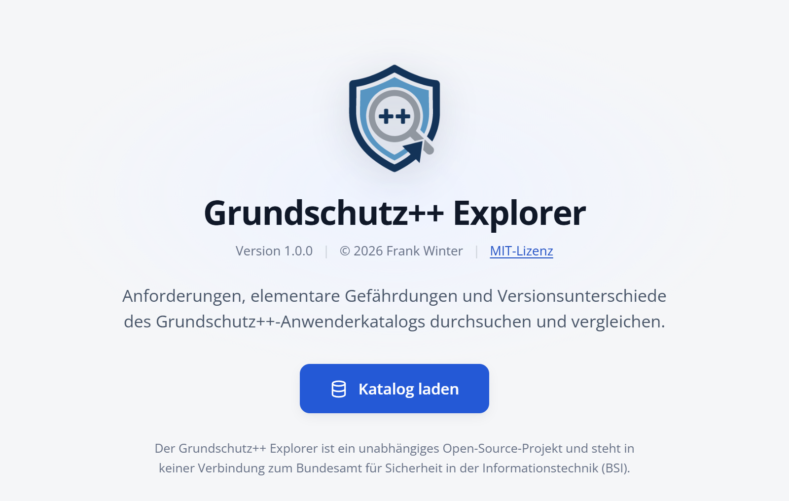

# Einführung

Der Grundschutz++ Explorer ist ein Werkzeug zum Lesen und Auswerten des **Anwenderkatalogs Grundschutz++**, den das Bundesamt für Sicherheit in der Informationstechnik (BSI) maschinenlesbar im Format OSCAL veröffentlicht. Der Katalog umfasst rund tausend Anforderungen. Im Explorer finden Sie die für Sie relevanten Anforderungen schnell, sehen alle Angaben zu einer Anforderung auf einen Blick und können zwei Stände des Katalogs miteinander vergleichen.

## Wofür der Explorer gedacht ist

- **Nachschlagen:** eine Anforderung über ihre Kennung, ihren Titel oder einen Begriff aus dem Text finden.
- **Eingrenzen:** den Katalog nach Modalverb, Schutzbedarf, Aufwand, Handlungswort, Dokumentationsvorgabe, Schutzzielen, Praktiken, elementaren Gefährdungen und Tags filtern.
- **Verstehen:** die Begriffe des BSI direkt an der Anforderung nachlesen, etwa was eine Aufwandsstufe bedeutet oder was ein Handlungswort genau verlangt.
- **Vergleichen:** eine neue Katalogversion gegen eine ältere halten und sehen, welche Anforderungen neu, geändert oder entfallen sind.

> [!NOTE]
> Der Explorer ist kein Angebot des BSI. Er zeigt die vom BSI veröffentlichten Daten unverändert an und ergänzt keine eigenen Bewertungen.

## Voraussetzungen

Sie benötigen nur einen aktuellen Browser, zum Beispiel Chrome, Edge, Firefox oder Safari. Eine Installation oder Anmeldung ist nicht nötig. Rufen Sie einfach die Adresse auf:

```text
https://www.grundschutz-explorer.de
```



Beim ersten Aufruf erscheint eine Startseite. Dort öffnen Sie mit **Katalog laden** den gleichnamigen Dialog und laden den aktuellen Grundschutz++-Katalog des BSI oder einen eigenen OSCAL-Katalog als Datei oder über eine URL. Darunter fasst die Startseite kurz zusammen, woher die Daten kommen und wie der Explorer mit Ihren Daten umgeht. Ein geladener Katalog bleibt in Ihrem Browser gespeichert und steht beim nächsten Aufruf sofort zur Verfügung. Die Startseite erscheint erst wieder, wenn Sie alle gespeicherten Kataloge gelöscht haben.

> [!NOTE]
> **Offiziellen BSI Grundschutz++ Anwenderkatalog laden** ruft die Datei direkt aus der Stand-der-Technik-Bibliothek des BSI auf GitHub ab. Vorher stellt der Explorer keine Verbindung zu GitHub her.

## Datenschutz

Der Explorer läuft vollständig in Ihrem Browser. Kataloge, Filter und Einstellungen speichert er ausschließlich lokal in der Datenbank Ihres Browsers. Es gibt kein Benutzerkonto, und es werden keine Inhalte an einen Server übertragen.

> [!TIP]
> Einzelne Kataloge löschen Sie unter **Kataloge** über den Papierkorb. Alle gespeicherten Kataloge und Einstellungen entfernen Sie in der **Datenschutzerklärung** mit **Alle lokal gespeicherten Daten löschen**.

## Aufbau dieses Handbuchs

Das Kapitel **Die Oberfläche im Überblick** stellt die Bereiche des Bildschirms vor. Die Kapitel im Teil **Arbeiten mit dem Katalog** beschreiben die Aufgaben Schritt für Schritt: navigieren, suchen und filtern, eine Anforderung lesen sowie Kataloge laden und vergleichen. Im **Anhang** finden Sie die wichtigsten Begriffe, alle Tastenkürzel und Angaben zu den Datenquellen.
