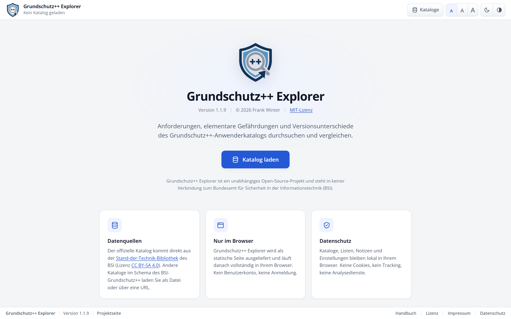
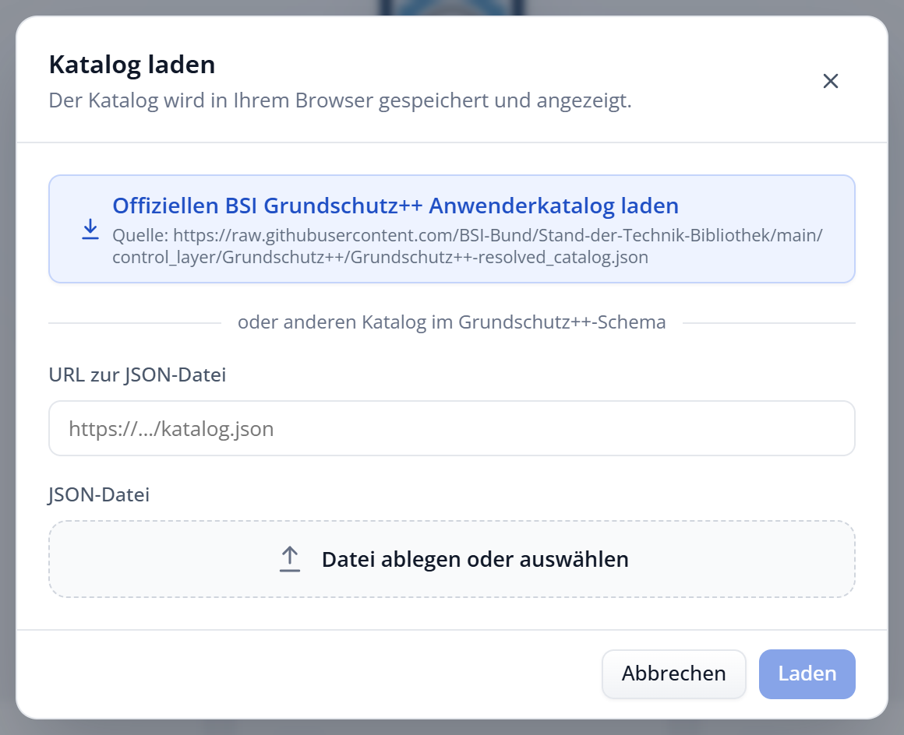

# Einführung

Grundschutz++ Explorer ist ein Werkzeug zum Erkunden, Durchsuchen und Auswerten des **Anwenderkatalogs Grundschutz++**, den das Bundesamt für Sicherheit in der Informationstechnik (BSI) maschinenlesbar im Format NIST OSCAL veröffentlicht. Der Katalog umfasst rund tausend Anforderungen und Unteranforderungen. Mit dem Explorer finden Sie die für Sie relevanten Anforderungen schnell, halten eigene Notizen in Listen fest, schlagen Begriffsdefinitionen des BSI nach und vergleichen zwei Katalogstände Wort für Wort.

Der Autor ist Informationssicherheitsbeauftragter einer deutschen Landesbehörde und hat das Projekt nebenberuflich als freies Open-Source-Vorhaben unter MIT-Lizenz entwickelt. Ziel ist ein schnelles, datensparsames und leicht verständliches Werkzeug für Sicherheitsverantwortliche, Auditorinnen und Auditoren sowie IT-Teams.

> Grundschutz++ Explorer ist ein unabhängiges Projekt und steht in keiner Verbindung zum Bundesamt für Sicherheit in der Informationstechnik (BSI). Der offizielle Grundschutz++-Anwenderkatalog und die Begriffsdefinitionen stammen aus der öffentlich zugänglichen Stand-der-Technik-Bibliothek des BSI und stehen unter der Lizenz CC BY-SA 4.0. Sie werden unverändert angezeigt. Die Rechte an diesen Inhalten liegen beim BSI.

## Wofür der Explorer gedacht ist

- **Nachschlagen:** Anforderungen über Kennung, Titel oder Volltext in Sekunden finden.
- **Eingrenzen:** den Katalog flexibel nach zahlreichen Inhalten filtern.
- **Listen und Notizen:** Anforderungen in eigene Listen aufnehmen, etwa für ein Audit, eine Arbeitsgruppe oder eine Umsetzungsbesprechung, und Notizen direkt an der Anforderung festhalten.
- **Verstehen:** die Definitionen des BSI per Info-Symbol direkt an der Anforderung nachschlagen, etwa was eine Aufwandsstufe bedeutet oder was eine Zielobjektkategorie umfasst.
- **Vergleichen:** einen neuen Katalogstand gegen einen älteren halten und sehen, welche Anforderungen neu hinzugekommen, geändert oder entfallen sind.

## Voraussetzungen

Sie benötigen nur einen aktuellen Webbrowser, etwa Chrome, Edge, Firefox oder Safari. Installation, Registrierung oder Anmeldung sind nicht nötig. Rufen Sie die Anwendung auf:

```text
https://www.grundschutz-explorer.de
```

{width=100%}

/// figure-caption
    attrs: {id: fig-startseite}
Startseite beim ersten Aufruf
///

Beim ersten Aufruf erscheint die Startseite. Über **Katalog laden** öffnen Sie den Ladedialog. Dort laden Sie den aktuellen Grundschutz++-Katalog direkt vom BSI oder einen anderen Katalog im Schema des Grundschutz++ per URL oder Datei. Darunter fasst die Startseite zusammen, woher die Daten stammen, dass der Explorer nur im Browser läuft und wie er mit Ihren Daten umgeht. Ein geladener Katalog bleibt in Ihrem Browser gespeichert und steht beim nächsten Besuch sofort bereit.

{width=55%}

/// figure-caption
    attrs: {id: fig-start-katalog-laden}
Dialog „Katalog laden“ mit offizieller BSI-Quelle, URL-Eingabe und Dateiauswahl
///

> [!NOTE]
> Die Schaltfläche **Offiziellen BSI Grundschutz++ Anwenderkatalog laden** ruft die Datei direkt aus der Stand-der-Technik-Bibliothek des BSI auf GitHub ab. Vorher stellt der Explorer keine Verbindung zu fremden Servern her.

## Datenschutz und lokale Speicherung

Grundschutz++ Explorer arbeitet vollständig in Ihrem Browser. Kataloge, Listen, Notizen, Filter und Einstellungen werden ausschließlich in der Datenbank Ihres Browsers (IndexedDB) abgelegt. Es gibt kein Tracking, keine Cookies und keine Übertragung Ihrer Daten an einen Server.

> [!TIP]
> Einzelne Kataloge löschen Sie im Dialog **Kataloge** über das Papierkorb-Symbol. Alle gespeicherten Daten (Kataloge, Listen, Notizen und Einstellungen) entfernen Sie über **Datenschutz** in der Fußzeile mit **Alle lokal gespeicherten Daten löschen**.

## Nutzung von KI bei der Softwareentwicklung

Bei der Entwicklung des Grundschutz++ Explorers wurden verschiedene KI-Modelle bewusst als Werkzeuge eingesetzt: beim Entwerfen und Schreiben von Code ebenso wie als Gesprächspartner für Architekturentscheidungen, für Anregungen zu Bedienung und Barrierearmut und für gegenseitige Code-Reviews, bei denen ein Modell die Entwürfe eines anderen prüft. Das hat die Entwicklung beschleunigt und die Codequalität spürbar verbessert.

Die Grenzen waren ebenso deutlich: Fachlicher Kontext, die Richtung des Projekts und der letzte Feinschliff kommen nicht aus einem Sprachmodell. Jede Änderung wurde vom Autor geprüft, zusammengeführt und verantwortet.

Grundschutz++ Explorer selbst enthält keine KI-Funktionen. Alle Daten bleiben ausschließlich in Ihrem Browser.

## Aufbau dieses Handbuchs

- **Grundlagen:** stellt die Oberfläche und ihre Bedienelemente vor.
- **Arbeiten mit dem Katalog:** führt durch Navigation, Suche und Filter, die Detailansicht, Listen und Notizen sowie den Versionsvergleich.
- **Anhang:** enthält Begriffe, Tastenkürzel sowie Datenquellen und Lizenzen.
