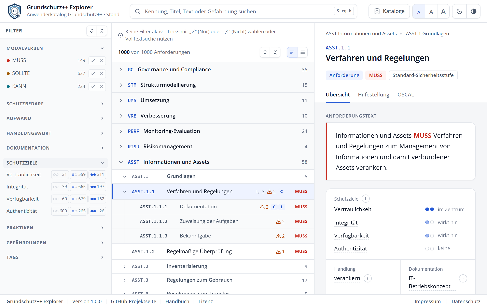
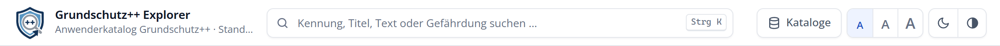

# Die Oberfläche im Überblick

Der Bildschirm ist in vier Bereiche gegliedert: die **Kopfzeile** oben, die **Filterleiste** links, die **Liste** der Anforderungen in der Mitte und die **Detailansicht** rechts.

## Kopfzeile

Von links nach rechts finden Sie:

| Element | Funktion |
| :--- | :--- |
| Logo und Titel | Zeigt den geladenen Katalog und seinen Stand. |
| Suchfeld | Durchsucht Kennungen, Titel, Anforderungstexte, Hilfestellungen, Gefährdungen und Tags. |
| Kataloge | Listet die gespeicherten Katalogversionen, startet den Vergleich und lädt neue Kataloge. |
| A A A | Stellt die Schriftgröße ein: normal, groß oder sehr groß. |
| Mond / Sonne | Wechselt zwischen hellem und dunklem Design. |
| Halbkreis | Schaltet den hohen Kontrast ein und aus. |

## Filterleiste

Die Filterleiste links enthält alle Filter, gegliedert in aufklappbare Abschnitte. Ein Klick auf die Überschrift eines Abschnitts klappt ihn auf oder zu. Die beiden Schaltflächen oben rechts klappen alle Abschnitte gemeinsam auf oder zu. Sobald ein Filter aktiv ist, erscheint daneben **Zurücksetzen**; es hebt alle Filter auf. Eine blaue Zahl neben einer Überschrift zeigt, wie viele Filter in diesem Abschnitt aktiv sind.

Wie Sie filtern, beschreibt das Kapitel **Suchen und filtern**.

## Liste der Anforderungen

Die Liste in der Mitte zeigt den Katalog entweder als **Baumansicht** (Praktik → Teilbereich → Anforderung → Unteranforderungen) oder als **flache Trefferliste**. Über der Liste stehen die aktiven Filter, die Anzahl der Treffer und die Schaltflächen zum Umschalten der Ansicht sowie zum Auf- und Zuklappen aller Ebenen.

Jede Zeile zeigt Kennung und Titel, rechts daneben kurze Hinweise:

- ein Pfeil mit Zahl: Anzahl der Unteranforderungen,
- ein Warndreieck mit Zahl: Anzahl der elementaren Gefährdungen,
- die Buchstaben **C**, **I**, **A** oder **Au**: Schutzziele, die im Zentrum der Anforderung stehen (Vertraulichkeit, Integrität, Verfügbarkeit, Authentizität),
- das Modalverb **MUSS**, **SOLLTE** oder **KANN**.

## Detailansicht

Die Detailansicht rechts zeigt alle Angaben zur ausgewählten Anforderung, oder eine Übersicht, wenn Sie eine Praktik oder einen Teilbereich ausgewählt haben. Die Breite zwischen Liste und Detailansicht verstellen Sie, indem Sie die Trennlinie mit der Maus ziehen.

## Darstellung anpassen

Der Explorer merkt sich die folgenden Einstellungen in Ihrem Browser:

- **Schriftgröße:** Die drei „A“ in der Kopfzeile vergrößern die Schrift auf 112,5 % oder 125 %. Die Filterleiste wird dabei etwas breiter, damit alle Beschriftungen lesbar bleiben.
- **Helles oder dunkles Design:** Beim ersten Aufruf folgt der Explorer der Einstellung Ihres Betriebssystems.
- **Hoher Kontrast:** verstärkt Schrift, Rahmen und Signalfarben. Alle Textfarben erreichen dann mindestens das Kontrastverhältnis 7:1. Auch hier gilt beim ersten Aufruf die Einstellung Ihres Betriebssystems.

> [!TIP]
> Schriftgröße und hoher Kontrast lassen sich kombinieren, im hellen wie im dunklen Design.
