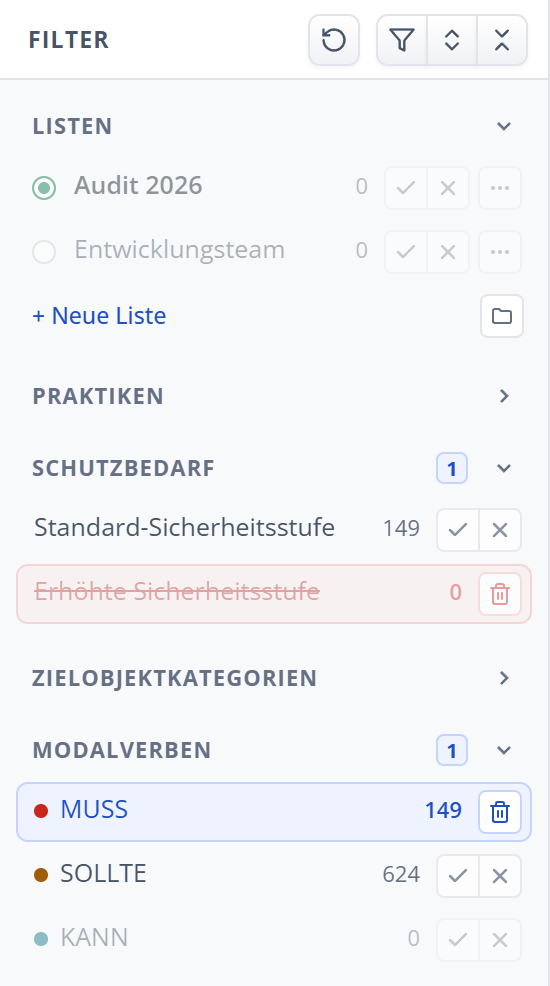
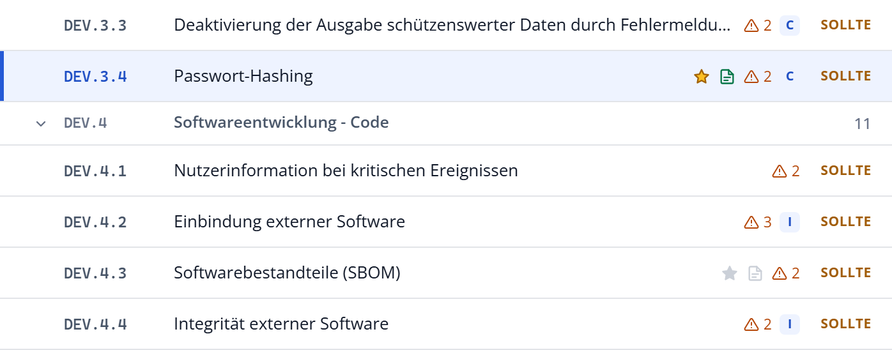
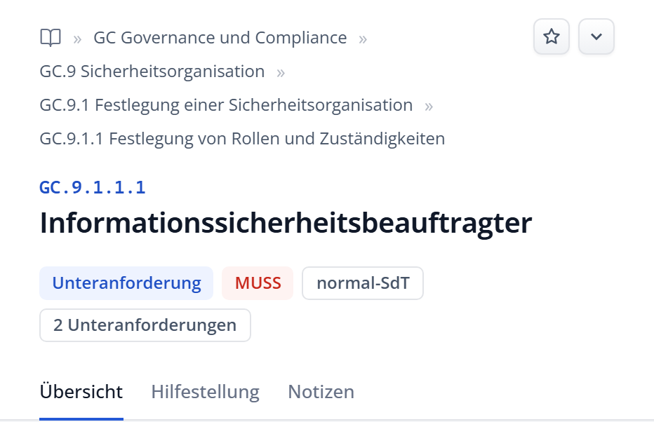

# Die Oberfläche im Überblick {#kap-oberflaeche}

Der Arbeitsbereich des Grundschutz++ Explorers besteht aus vier Bereichen: der **Kopfzeile** oben, der **Filterleiste** links, der **Liste der Anforderungen** in der Mitte und der **Detailansicht** rechts. Die Fußzeile verweist auf Handbuch, Lizenz, Impressum und Datenschutz.

{width=100%}

/// figure-caption
    attrs: {id: fig-oberflaeche}
Gesamtansicht: Filterleiste, Baumansicht mit der gewählten Anforderung DEV.3.4 und ihre Detailansicht
///

## Kopfzeile

{width=100%}

/// figure-caption
    attrs: {id: fig-kopfzeile}
Kopfzeile mit Katalogname, Suche, Katalogen und Darstellungsschaltern
///

Von links nach rechts bietet die Kopfzeile:

| Element | Funktion |
| :--- | :--- |
| **Logo und Titel** | Name der Anwendung, darunter Titel und Stand des angezeigten Katalogs. |
| **Suchfeld** | Durchsucht Kennungen, Titel, Anforderungstexte, Hilfestellungen, Gefährdungen und Tags, während Sie tippen (Tastenkürzel: `Strg + K` oder `/`). |
| **Kataloge** | Öffnet den Dialog mit den gespeicherten Katalogständen: anzeigen, vergleichen, löschen und neue Kataloge laden. |
| **A A A** | Schriftgröße in drei Stufen: normal, groß (112,5 %) und sehr groß (125 %). |
| **Mond / Sonne** | Wechselt zwischen hellem und dunklem Design. |
| **Halbkreis** | Schaltet den hohen Kontrast ein oder aus. |

## Filterleiste

Die linke Spalte enthält alle Filter in auf- und zuklappbaren Bereichen. Nach den eigenen Listen folgen sie weitgehend der Reihenfolge der Detailansicht, sodass Sie eine Angabe der Anforderung links an vergleichbarer Stelle wiederfinden.

{width=32%}

/// figure-caption
    attrs: {id: fig-filterleiste}
Ausschnitt der Filterleiste: Schaltflächen oben, auf- und zugeklappte Bereiche, eingeschlossenes Modalverb MUSS und ausgeschlossene Erhöhte Sicherheitsstufe
///

Die Bereiche in ihrer Reihenfolge:

1. **Listen:** eigene Sammlungen von Anforderungen mit Notizen.
2. **Praktiken:** die oberste Gliederungsebene des Katalogs, etwa GC Governance und Compliance oder DEV Entwicklung.
3. **Schutzbedarf:** Standard-Sicherheitsstufe oder Erhöhte Sicherheitsstufe.
4. **Zielobjektkategorien:** worauf sich eine Anforderung bezieht, etwa Anwendungen oder Nutzende; auf Wunsch einschließlich der übergeordneten Kategorien.
5. **Modalverben:** MUSS, SOLLTE oder KANN.
6. **Handlungswort:** das Verb der geforderten Handlung, etwa *dokumentieren* oder *prüfen*.
7. **Schutzziele:** Wirkung auf Vertraulichkeit, Integrität, Verfügbarkeit und Authentizität.
8. **Aufwand:** Aufwandsstufen 0 bis 5 mit farbigem Balken.
9. **Dokumentation:** die geforderte Dokumentationsvorgabe, etwa *Sicherheitskonzept*.
10. **Gefährdungen:** die elementaren Gefährdungen G 0.1 bis G 0.47.
11. **Quellkataloge:** aus welchem Teilkatalog des BSI eine Anforderung stammt.
12. **Tags:** Schlagwörter des BSI.
13. **Änderungen:** nur im Vergleichsmodus, neu, geändert oder gelöscht.

Die Bereiche mit vielen Werten (Zielobjektkategorien, Handlungswort, Dokumentation, Gefährdungen und Tags) haben ein eigenes Suchfeld. Gesetzte Werte stehen dort immer oben.

Oben in der Filterleiste stehen vier Schaltflächen:

- **Alle Filter zurücksetzen** (Kreispfeil): hebt alle gesetzten Filter und die Suche auf.
- **Werte ohne Treffer ausblenden** (Trichter): zeigt nur noch Werte, die zu den übrigen Filtern passen. Ein zweiter Klick zeigt wieder alle.
- **Alle Filterbereiche aufklappen** und **Alle Filterbereiche zuklappen**.

## Liste der Anforderungen

Die mittlere Spalte zeigt die Anforderungen als **Baumansicht** oder als **flache Trefferliste**.

{width=70%}

/// figure-caption
    attrs: {id: fig-listen-markierungen}
Zeilen der Baumansicht mit Stern, Notizsymbol, Gefährdungen, Schutzziel im Zentrum und Modalverb
///

Darüber stehen die Trefferzahl, im Baum die Schaltflächen **Alle aufklappen** und **Alle zuklappen** sowie die beiden Umschalter für Baum und flache Liste. Sind Filter gesetzt, fassen **Filter-Chips** über der Liste sie zusammen (siehe [Kapitel „Suchen und filtern“](#kap-suchen-filtern)). Jede Zeile zeigt Kennung, Titel und rechts das Modalverb. Dazwischen stehen, wenn zutreffend, diese Markierungen:

| Markierung | Bedeutung |
| :--- | :--- |
| **Stern** | Gelb: in der aktiven Liste. Grau: nur in einer anderen Liste. Ohne Stern: in keiner Liste. |
| **Notizsymbol** | Grün: Notiz in der aktiven Liste. Grau: Notiz nur in einer anderen Liste. |
| **Pfeil mit Zahl** | Anzahl der direkten Unteranforderungen. |
| **Warndreieck mit Zahl** | Anzahl der zugeordneten elementaren Gefährdungen. |
| **C, I, A, Au** | Schutzziele, die im Zentrum der Anforderung stehen (Vertraulichkeit, Integrität, Verfügbarkeit, Authentizität). |
| **Neu, Geändert, Gelöscht** | Nur im Vergleichsmodus: Änderungsstatus gegenüber dem Vergleichsstand. |

/// table-caption
    attrs: {id: tbl-listen-markierungen}
Markierungen in den Zeilen der Anforderungsliste
///

## Detailansicht

Die rechte Spalte zeigt alle Angaben zur ausgewählten Anforderung. Ist keine Anforderung gewählt, zeigt sie eine Übersicht über den Katalog, bei gewählter Praktik oder gewähltem Thema eine Übersicht über diese Ebene.

{width=48%}

/// figure-caption
    attrs: {id: fig-detail-kopf}
Kopfbereich der Detailansicht am Beispiel der Unteranforderung GC.9.1.1.1: Pfadleiste mit übergeordneten Anforderungen, Kennung, Titel, Stern, Hinweise und Reiter
///

- **Pfadleiste:** beginnt mit einem Buch-Symbol, das zur Katalogübersicht führt, gefolgt von Praktik, Thema und gegebenenfalls übergeordneten Anforderungen.
- **Kopfbereich:** Kennung, Titel und Stern für die Aufnahme in die aktive Liste. Darunter Hinweise auf Art (*Anforderung* oder *Unteranforderung*), Modalverb, Schutzbedarf, die Zahl der Unteranforderungen und Gefährdungen (jeweils einschließlich aller Unteranforderungen) und im Vergleichsmodus den Änderungsstatus.
- **Reiter:** *Übersicht*, *Hilfestellung*, *Notizen* und im Vergleichsmodus *Änderungen*.

Das [Kapitel „Die Detailansicht“](#kap-detailansicht) beschreibt die Reiter im Einzelnen.

> [!TIP]
> Die Breite der Detailansicht ändern Sie, indem Sie die Trennlinie zwischen Liste und Detailansicht mit der Maus ziehen. Ein Doppelklick auf die Trennlinie stellt die Standardbreite wieder her. Haben Sie die Trennlinie angeklickt oder mit der Tabulatortaste erreicht, verschieben die Pfeiltasten sie in Schritten von 1 %, mit gedrückter Umschalttaste in Schritten von 5 %. Die Breite wird im Browser gespeichert.
