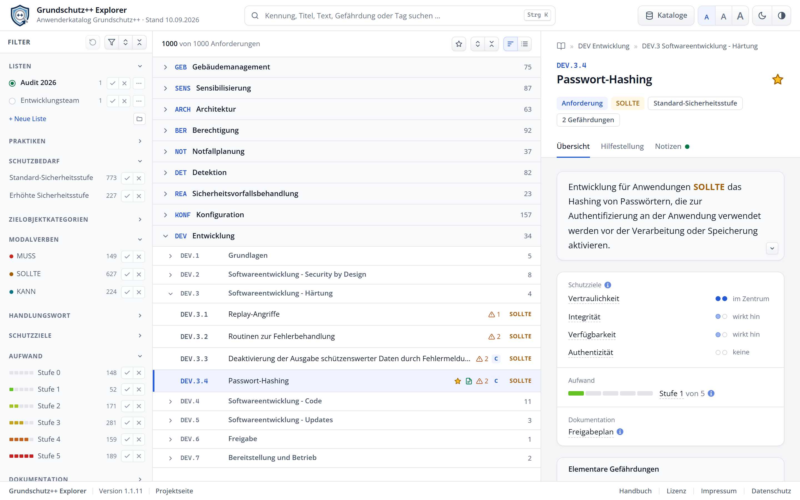
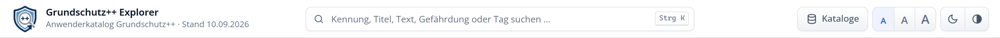

# Die Oberfläche im Überblick

Der Arbeitsbereich des Grundschutz++ Explorers gliedert sich in vier Hauptbereiche: die **Kopfzeile** oben, die **Filterleiste** links, die **Liste der Anforderungen** in der Mitte und die **Detailansicht** auf der rechten Seite.

{width=100%}

/// figure-caption
    attrs: {id: fig-oberflaeche}
Gesamtansicht mit Filterleiste, Baumansicht und Detailansicht
///

## Kopfzeile

{width=100%}

/// figure-caption
    attrs: {id: fig-kopfzeile}
Kopfzeile mit Logo, Suche, Katalogen und Darstellungsschaltern
///

Von links nach rechts bietet die Kopfzeile folgende Funktionen:

| Element | Funktion |
| :--- | :--- |
| **Logo und Titel** | Zeigt das Schutzschild-Logo, den Namen des geladenen Katalogs und dessen Stand. |
| **Suchfeld** | Durchsucht Kennungen, Titel, Anforderungstexte, Hilfestellungen, Gefährdungsbezeichnungen und Tags in Echtzeit (Tastaturkürzel: `Strg + K` oder `/`). |
| **Kataloge** | Öffnet den Dialog zur Verwaltung gespeicherter Versionen, zum Starten/Beenden des Vergleichs und zum Laden neuer Kataloge. |
| **A A A** | Dreistufige Skalierung der Schriftgröße: normal (100 %), groß (112,5 %) oder sehr groß (125 %). |
| **Sonne / Mond** | Wechselt zwischen hellem und dunklem Oberflächendesign. |
| **Halbkreis** | Schaltet den hohen Kontrastmodus ein oder aus (garantiert WCAG-Kontrastverhältnis ≥ 7:1 für alle Texte). |

## Filterleiste

Die linke Spalte enthält alle Filter-Facetten in aufklappbaren Abschnitten. Nach den eigenen Listen folgen sie der Reihenfolge der Detailansicht von oben nach unten, sodass sich jede Angabe einer Anforderung links an derselben Stelle wiederfindet:

1. **Listen:** Eigene Sammlungen von Anforderungen mit Notizen (z. B. Audit-Vorbereitung oder Maßnahmenkataloge).
2. **Praktiken:** Thematische Schwerpunkte wie Governance (GC), Architektur (ARCH) oder Entwicklung (DEV).
3. **Schutzbedarf:** Standard-Sicherheitsstufe oder Erhöhte Sicherheitsstufe.
4. **Zielobjekte:** Worauf sich die Anforderung bezieht (z. B. IT-Systeme, Nutzende).
5. **Modalverben:** Verbindlichkeitsgrad nach BSI (MUSS, SOLLTE, KANN).
6. **Handlungswort & Dokumentation:** Fachliche Vorgaben des BSI mit Definitions-Tooltips.
7. **Tags:** Offizielle Schlagwörter des BSI.
8. **Schutzziele:** Gezielte Filterung nach Vertraulichkeit (C), Integrität (I), Verfügbarkeit (A) und Authentizität (Au).
9. **Aufwand:** Geschätzte Aufwandsstufe von 0 bis 5 mit farbiger Balkenanzeige.
10. **Elementare Gefährdungen:** BSI-Gefährdungen G 0.1 bis G 0.47.
11. **Änderungen:** Erscheint nur im Vergleichsmodus (neu, geändert, gelöscht).

Oben rechts in der Filterleiste befinden sich drei Funktionsschaltflächen:
- **Alle Filter zurücksetzen** (Kreispfeil): Setzt alle aktiven Filter zurück.
- **Werte ohne Treffer ausblenden** (Trichter): Komprimiert die Filterleiste auf Werte, die zu den übrigen Kriterien passen.
- **Alle Abschnitte auf-/zuklappen**: Klappt alle Facettengruppen gleichzeitig auf oder zu.

## Liste der Anforderungen

Die mittlere Spalte präsentiert die Anforderungen wahlweise als strukturierte **Baumansicht** oder als **flache Trefferliste**:

- Über der Liste fassen **Filter-Chips** alle aktuell gesetzten Filterkriterien zusammen.
- Die Trefferzahl nennt die Anzahl der angezeigten Anforderungen.
- Jede Zeile zeigt Kennung, Titel, das Modalverb sowie informative Statusmarkierungen:
  - Ein **Stern**: Gelb = Anforderung ist in der aktiven Liste; Grau = in einer anderen Liste; Umriss = in keiner Liste.
  - Ein **Notizsymbol**: Grün = Notiz in der aktiven Liste vorhanden; Grau = Notiz in anderer Liste vorhanden.
  - Pfeil mit Zahl: Anzahl untergeordneter Anforderungen.
  - Warndreieck mit Zahl: Anzahl zugeordneter elementarer Gefährdungen.
  - Kürzel **C**, **I**, **A**, **Au**: Schutzziele, die für diese Anforderung im Zentrum stehen.
  - Im Vergleichsmodus: Farbige Kennzeichnung für **Neu** (grün), **Geändert** (gelb) oder **Gelöscht** (rot).

## Detailansicht

Die rechte Spalte zeigt sämtliche Detailinformationen zur aktuell ausgewählten Anforderung:

- **Pfadleiste (Breadcrumb):** Beginnt mit einem **Buch-Symbol**, das zur Katalogübersicht zurückführt, gefolgt von der Praktik, dem Thema und gegebenenfalls übergeordneten Anforderungen.
- **Kopfbereich:** Kennung, vollständiger Titel, Stern für Listenaufnahme sowie Badges für Anforderungsart, Anzahl der Unteranforderungen und Gefährdungen (jeweils einschließlich aller Unteranforderungen), Schutzbedarf und Änderungsstatus.
- **Reiter (Tabs):**
  - **Übersicht:** Vollständiger Anforderungstext, Zielobjekt, Modalverb, Handlungswort, Dokumentationsvorgabe, Tags, Schutzziele, Aufwand, Gefährdungen und Unteranforderungen.
  - **Hilfestellung:** BSI-Hinweise zur praktischen Umsetzung und darunter der Satzaufbau: der Anforderungstext zerlegt in Zielobjekt, Modalverb, gefordertes Ergebnis, Spezifikation und Handlung.
  - **Notizen:** Eigenes Notizfeld für die aktive Liste, Umschaltung zwischen Listennotizen und Änderungsdatum.
  - **Änderungen:** Im Vergleichsmodus Gegenüberstellung aller veränderten Felder und Wort-für-Wort-Vergleich.

> [!TIP]
> Die Breite der Detailansicht lässt sich mit der Maus an der Trennlinie zwischen Liste und Detailbereich stufenlos anpassen (Standard: 30 %, Doppelklick auf die Trennlinie setzt sie zurück). Die gewählte Breite wird automatisch im Browser gespeichert.

## Darstellung anpassen

Der Explorer speichert Ihre Anzeigeeinstellungen dauerhaft im Browser:

- **Schriftgröße:** Über den dreiteiligen Knopf **A A A** schalten Sie zwischen drei Schriftgrößen um. Bei größeren Schriften wächst die Filterleiste proportional mit, damit alle Bezeichnungen vollständig lesbar bleiben.
- **Dunkel- und Hell-Modus:** Beim Erstaufruf übernimmt der Explorer die Systemeinstellung Ihres Betriebssystems.
- **Hoher Kontrast:** Hebt Rahmen, Texte und Signalfarben hervor, um maximale Lesbarkeit bei eingeschränktem Sehvermögen oder ungünstigen Lichtverhältnissen zu gewährleisten.
