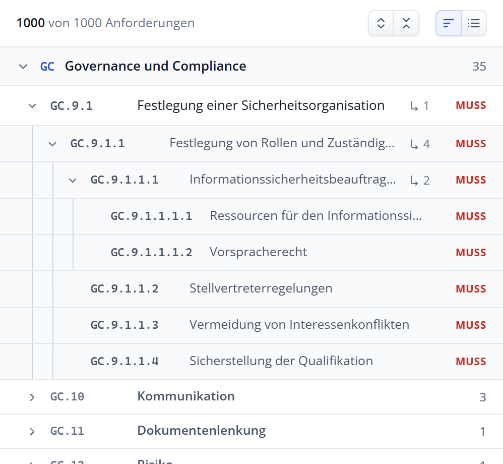

# Im Katalog navigieren

Der Grundschutz++-Katalog besitzt eine durchgängige, vierstufige Hierarchie:

1. **Praktiken** (z. B. `DEV Entwicklung` oder `GC Governance und Compliance`)
2. **Teilbereiche** (z. B. `DEV.4 Softwareentwicklung - Code`)
3. **Anforderungen** (z. B. `DEV.4.3 Softwarebestandteile (SBOM)`)
4. **Unteranforderungen** (z. B. `DEV.1.1.1 Dokumentation`, bis hin zu tieferen Verästelungen wie `GC.9.1.1.1.1`)

## Die Baumansicht

In der Baumansicht navigieren Sie intuitiv durch die hierarchische Struktur:

- **Praktik oder Teilbereich aufklappen:** Ein Klick auf den kleinen Pfeil am Zeilenanfang klappt die Unterelemente auf oder zu, ohne die Detailansicht zu verändern. Ein Klick auf den Text zeigt rechts zusätzlich eine zusammenfassende Übersicht.
- **Anforderung auswählen:** Ein Klick auf die Anforderungszeile öffnet ihre Detailansicht. Besitzt die Anforderung eigene Unteranforderungen, werden diese automatisch im Baum aufgefaltet.
- **Tiefere Ebenen:** Eingerückte Zeilen und vertikale Hilfslinien visualisieren die Überordnungen. Die Zahl am Pfeil rechts außen nennt die Anzahl der direkten Unteranforderungen.
- **Alle auf- oder zuklappen:** Über die Schaltflächen oberhalb der Liste falten Sie alle Ebenen mit einem Klick auf oder zu.

{width=65%}

/// figure-caption
    attrs: {id: fig-unteranforderungen}
Mehrstufige Unteranforderungen am Beispiel von GC.9.1 Festlegung einer Sicherheitsorganisation (Ebenen 1 bis 3)
///

## Übersicht einer Praktik oder eines Teilbereichs

Wählen Sie eine Praktik oder einen Teilbereich aus, blendet die rechte Seite eine übersichtliche Zusammenfassung ein:

Die Übersicht liefert auf einen Blick:
- Die offizielle Zweckbestimmung und Beschreibung des BSI.
- Statistische Kennzahlen: Gesamtzahl der Anforderungen, gegliedert nach Basis- und Unteranforderungen.
- Verteilung der Modalverben auf MUSS, SOLLTE und KANN.
- Die Liste der untergeordneten Teilbereiche oder Anforderungen.
- Im Vergleichsmodus: Die Anzahl neu hinzugekommener, geänderter oder entfallener Anforderungen.

## Pfadleiste (Breadcrumb)

Über der Überschrift der Detailansicht zeigt die Pfadleiste Ihre aktuelle Position im Katalog:

```text
[Buch-Symbol]  »  DEV Entwicklung  »  DEV.4 Softwareentwicklung - Code
```

- **Buch-Symbol am Anfang:** Führt mit einem Klick zur **Katalogübersicht** mit allgemeinen Metadaten, Normverweisen und Versionsständen zurück (zugeklapptes Buch = Katalogübersicht aktiv, aufgeschlagenes Buch = Anforderung aktiv).
- **Hierarchische Knoten:** Zeigt den exakten Pfad von der Praktik über den Teilbereich bis zu eventuellen Elternanforderungen. Jeder Knoten lässt sich anklicken, um direkt zur entsprechenden Ebene zu springen.
- **Fokus auf das Wesentliche:** Die Pfadleiste endet übersichtlich bei der übergeordneten Gruppe, da Kennung und Titel der aktuellen Anforderung bereits prominent als Hauptüberschrift darunter stehen.

## Flache Trefferliste

Sobald Sie einen Filter setzen oder einen Suchbegriff eingeben, wechselt der Explorer automatisch in die **flache Trefferliste**. Sie blendet die Zwischenebenen aus und listet alle Treffer kompakt untereinander.

Über die beiden Symbole oben rechts in der mittleren Spalte können Sie jederzeit manuell zwischen **Baumansicht** und **flacher Trefferliste** umschalten.

## Tastaturnavigation

Für zügiges und barrierefreies Arbeiten lässt sich der Katalog vollständig per Tastatur erkunden:

- **↑ / ↓** (oder **k / j**): Springt zur vorherigen bzw. nächsten Anforderung.
- **→ (Rechtspfeil):** Klappt die Unteranforderungen der aktuell ausgewählten Anforderung auf.
- **← (Linkspfeil):** Klappt geöffnete Unteranforderungen zu oder springt von einer Unteranforderung direkt zur übergeordneten Anforderung.
- **Eingabe:** Wählt das fokussierte Element aus.
