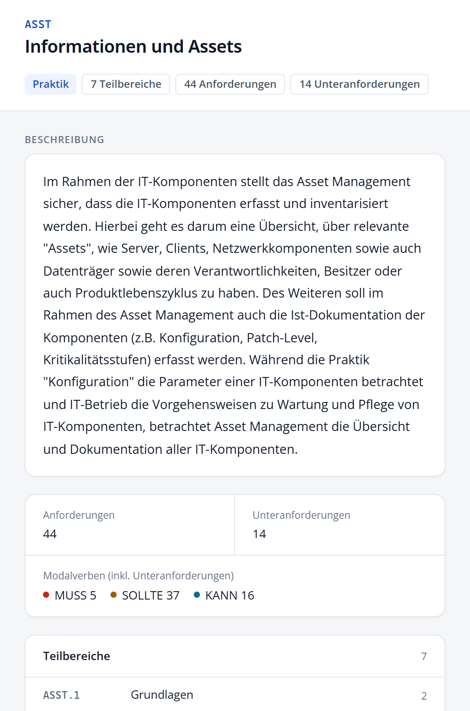

# Im Katalog navigieren

Der Grundschutz++-Katalog ist hierarchisch aufgebaut. **Praktiken** wie „GC Governance und Compliance“ gliedern sich in **Teilbereiche** wie „GC.1 Grundlagen“. Diese enthalten die **Anforderungen**, etwa „GC.1.1“, und manche Anforderungen haben **Unteranforderungen**, etwa „GC.1.1.1“.

## Baumansicht

Nach dem Laden eines Katalogs sind alle Praktiken eingeklappt.

- Ein Klick auf eine **Praktik** oder einen **Teilbereich** klappt die Ebene auf und zeigt rechts eine Übersicht. Ein weiterer Klick auf dieselbe Zeile klappt sie wieder zu.
- Der **Pfeil** am Zeilenanfang klappt nur auf oder zu, ohne die Detailansicht zu wechseln.
- Ein Klick auf eine **Anforderung** zeigt sie rechts in der Detailansicht. Hat sie Unteranforderungen, klappen diese automatisch auf.
- Die Schaltflächen über der Liste klappen alle Ebenen auf oder zu.

## Übersicht einer Praktik oder eines Teilbereichs



Die Übersicht zeigt:

- bei einer Praktik die Beschreibung des BSI und die Liste ihrer Teilbereiche,
- bei einem Teilbereich die Liste seiner Anforderungen mit Modalverb und Zahl der Unteranforderungen,
- die Anzahl der Anforderungen und Unteranforderungen,
- die Verteilung auf MUSS, SOLLTE und KANN,
- im Vergleichsmodus zusätzlich die Zahl der neuen, geänderten und gelöschten Anforderungen.

Ein Klick auf einen Eintrag der Liste führt eine Ebene tiefer.

## Breadcrumb

Über dem Titel der Detailansicht steht der Pfad zur aktuellen Anforderung, zum Beispiel:

```text
ASST Informationen und Assets  »  ASST.1 Grundlagen  »  ASST.1.1 …
```

Ein Klick auf einen Eintrag öffnet die Übersicht dieser Ebene und zeigt sie in der Baumansicht. Der Breadcrumb setzt dabei keine Filter, er dient nur der Navigation. Bei einer Unteranforderung erreichen Sie über den Breadcrumb auch die übergeordnete Anforderung.

## Flache Trefferliste

Sobald Sie einen Filter setzen oder suchen, wechselt die Liste automatisch in die **flache Trefferliste**. Sie zeigt nur die passenden Anforderungen, ohne die Ebenen der Praktiken und Teilbereiche. Heben Sie alle Filter auf, wechselt der Explorer wieder in die Baumansicht. Über die beiden Schaltflächen rechts über der Liste können Sie jederzeit selbst zwischen **Baumansicht** und **flacher Trefferliste** wählen.

## Mit der Tastatur blättern

Mit den Pfeiltasten **↑** und **↓** (oder **k** und **j**) wählen Sie die vorige oder nächste sichtbare Anforderung. Aus der Übersicht einer Praktik oder eines Teilbereichs heraus springen Sie damit zur ersten bzw. letzten Anforderung dieser Ebene. Alle Tastenkürzel finden Sie im Anhang.
