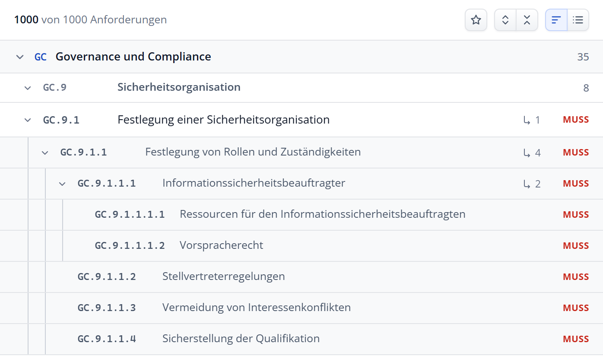

# Im Katalog navigieren {#kap-navigieren}

Der Grundschutz++-Katalog ist durchgängig hierarchisch gegliedert:

1. **Praktiken**, etwa `DEV Entwicklung` oder `GC Governance und Compliance`
2. **Themen**, etwa `DEV.4 Softwareentwicklung - Code`
3. **Anforderungen**, etwa `DEV.4.3 Softwarebestandteile (SBOM)`
4. **Unteranforderungen**, etwa `GC.9.1.1`, teils über mehrere Ebenen bis `GC.9.1.1.1.1`

## Die Baumansicht

Die Baumansicht bildet diese Gliederung ab:

- **Aufklappen:** Ein Klick auf den Pfeil am Zeilenanfang klappt eine Praktik, ein Thema oder eine Anforderung mit Unteranforderungen auf oder zu, ohne die Detailansicht zu ändern.
- **Übersicht einer Praktik oder eines Themas:** Ein Klick auf den Namen klappt die Ebene auf und zeigt rechts ihre Übersicht. Ein weiterer Klick auf dieselbe Zeile klappt sie wieder zu.
- **Anforderung auswählen:** Ein Klick auf eine Anforderung öffnet ihre Detailansicht. Hat sie Unteranforderungen, klappen diese automatisch auf.
- **Tiefere Ebenen:** Unteranforderungen sind eingerückt, senkrechte Linien zeigen die Zugehörigkeit. Die Zahl neben dem Pfeilsymbol rechts nennt die direkten Unteranforderungen.
- **Alle auf- oder zuklappen:** Die beiden Schaltflächen über der Liste klappen alle Ebenen auf einmal auf oder zu.
- **Mitlaufende Kopfzeilen:** Beim Blättern bleibt die Zeile der aktuellen Praktik oben stehen, sodass Sie immer sehen, wo Sie sich befinden.

{width=70%}

/// figure-caption
    attrs: {id: fig-unteranforderungen}
Mehrstufige Unteranforderungen am Beispiel von GC.9.1 Festlegung einer Sicherheitsorganisation
///

## Übersicht von Katalog, Praktik und Thema

Wählen Sie eine Praktik oder ein Thema, zeigt die Detailansicht eine Übersicht über diese Ebene. Ist nichts ausgewählt, erscheint dieselbe Übersicht für den ganzen Katalog. Sie enthält:

- unter dem Titel den Umfang: die Zahl der Praktiken, Themen, Anforderungen und Unteranforderungen darunter;
- die Beschreibung des BSI;
- beim Katalog seine Angaben aus den OSCAL-Metadaten, etwa Version, Veröffentlichung, letzte Änderung, umgesetzte Norm, Verantwortliche, Verweise, Schlagwörter und frühere Fassungen;
- die Verteilung der Modalverben auf MUSS, SOLLTE und KANN;
- im Vergleichsmodus die Zahl der neuen, geänderten und gelöschten Anforderungen;
- die Einträge der Ebene darunter (Praktiken, Themen oder Anforderungen) zum direkten Anklicken.

Die Zahlen der Übersicht beziehen sich immer auf den ganzen Katalog bzw. die ganze Ebene, unabhängig von gesetzten Filtern. Passt unter einer Praktik oder einem Thema keine Anforderung zu den Filtern, bleibt die Übersicht sichtbar. Ein Hinweis darüber nennt den Grund und bietet **Filter zurücksetzen** an.

## Pfadleiste

Über Kennung und Titel zeigt die Pfadleiste, wo im Katalog Sie sich befinden:

```text
[Buch-Symbol]  »  DEV Entwicklung  »  DEV.4 Softwareentwicklung - Code
```

- **Buch-Symbol:** führt zur Katalogübersicht. In der Katalogübersicht ist das Buch zugeklappt, sonst aufgeschlagen.
- **Praktik, Thema und übergeordnete Anforderungen:** Jeder Eintrag lässt sich anklicken und springt zu dieser Ebene in der Baumansicht.
- Die Pfadleiste endet bei der übergeordneten Ebene, denn Kennung und Titel der gewählten Anforderung stehen direkt darunter.

## Flache Trefferliste

Sobald Sie einen Filter setzen oder einen Suchbegriff eingeben, wechselt die Liste in die **flache Trefferliste**. Sie lässt die Ebenen Praktik und Thema weg und zeigt alle Treffer untereinander. Unteranforderungen stehen eingerückt unter ihrer Anforderung. Heben Sie alle Filter auf, kehrt die Liste zur vorherigen Ansicht zurück, und der Baum ist wieder so aufgeklappt wie vorher.

Mit den beiden Schaltflächen oben rechts über der Liste wechseln Sie jederzeit selbst zwischen **Baumansicht** und **flacher Trefferliste**. Auch in der Baumansicht wirken die Filter: Sie zeigt dann nur Praktiken und Themen mit Treffern. Anforderungen, die nur wegen passender Unteranforderungen im Baum stehen, erscheinen abgeschwächt.

## Tastatur

Die Liste lässt sich vollständig mit der Tastatur bedienen, solange der Cursor nicht in einem Eingabefeld steht:

- **↓ / ↑** (oder **j / k**): nächste bzw. vorherige Anforderung auswählen. Aus einer Übersicht heraus springen die Tasten zur ersten bzw. letzten Anforderung dieser Ebene.
- **→:** Unteranforderungen der gewählten Anforderung aufklappen.
- **←:** Unteranforderungen zuklappen bzw. von einer Unteranforderung zur übergeordneten Anforderung springen.

Alle Tastenkürzel fasst der [Anhang „Tastenkürzel“](#anh-tastatur) zusammen.
