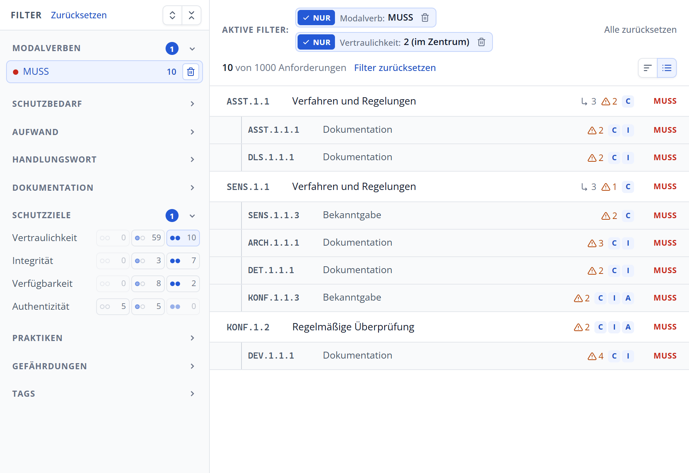

# Suchen und filtern

Suche und Filter lassen sich frei kombinieren. Eine Anforderung erscheint nur, wenn sie **alle** gesetzten Bedingungen erfüllt.

## Volltextsuche

Das Suchfeld in der Kopfzeile durchsucht Kennungen, Titel, Anforderungstexte, Hilfestellungen und die Bezeichnungen der Gefährdungen. Die Treffer erscheinen sofort während der Eingabe.

- **Strg + K** oder **/** setzt den Cursor ins Suchfeld.
- **Esc** leert das Suchfeld.
- Das Kreuz rechts im Suchfeld leert es ebenfalls.

## Einen Filter setzen

Jeder Wert in der Filterleiste hat rechts zwei Schaltflächen:

| Schaltfläche | Wirkung |
| :--- | :--- |
| **✓** (Nur) | Zeigt nur Anforderungen mit diesem Wert. |
| **✕** (Nicht) | Blendet Anforderungen mit diesem Wert aus. |
| Papierkorb | Erscheint bei aktiven Werten und hebt den Filter wieder auf. |

Ein Klick auf den Namen eines Werts wirkt wie **✓**, ein weiterer Klick hebt den Filter wieder auf. Die Zahl neben einem Wert gibt an, wie viele Anforderungen es mit den übrigen gesetzten Filtern zusammen ergibt. Werte ohne Treffer sind blass dargestellt.

> [!NOTE]
> Innerhalb eines Abschnitts kann jeweils nur ein Wert mit **✓** gewählt sein, weil eine Anforderung zum Beispiel nicht gleichzeitig MUSS und SOLLTE sein kann. Mit **✕** können Sie dagegen mehrere Werte ausschließen.

## Die Filterbereiche

| Bereich | Filtert nach |
| :--- | :--- |
| Modalverben | Verbindlichkeit: MUSS, SOLLTE, KANN |
| Schutzbedarf | Sicherheitsstufe: Standard-Sicherheitsstufe oder erhöhte Sicherheitsstufe |
| Aufwand | Aufwandsstufe 0 bis 5, jeweils mit farbigem Balken |
| Handlungswort | Das Verb, das die geforderte Handlung beschreibt, etwa „dokumentieren“ oder „verankern“ |
| Dokumentation | Die Dokumentationsvorgabe, etwa „IT-Betriebskonzept“ |
| Schutzziele | Wirkung auf Vertraulichkeit, Integrität, Verfügbarkeit und Authentizität |
| Praktiken | Die Praktiken des Katalogs, etwa GC, ARCH oder OPS |
| Gefährdungen | Die elementaren Gefährdungen G 0.1 bis G 0.47 |
| Tags | Schlagwörter des BSI, etwa „Zero Trust“ |
| Änderungen | Nur im Vergleichsmodus: neu, geändert, gelöscht |

In den langen Listen **Handlungswort**, **Dokumentation**, **Gefährdungen** und **Tags** hilft ein Suchfeld oberhalb der Werte. Bei den Gefährdungen blendet **Nur mit Treffern** alle Gefährdungen aus, die zu keiner der aktuell passenden Anforderungen gehören.

> [!TIP]
> Fahren Sie mit der Maus über einen Wert, um die Definition des BSI zu sehen, etwa was ein Handlungswort genau verlangt oder wie eine Aufwandsstufe definiert ist.

## Schutzziele filtern

Bei den Schutzzielen hat jede Zeile drei Schaltflächen für die Wirkungsstufen:

| Symbol | Stufe | Bedeutung |
| :--- | :--- | :--- |
| ○○ | 0 | Die Anforderung wirkt nicht oder kaum auf dieses Schutzziel. |
| ●○ | 1 | Die Anforderung wirkt auf dieses Schutzziel hin. |
| ●● | 2 | Das Schutzziel steht im Zentrum der Anforderung. |

Ein **Klick** zeigt nur Anforderungen mit dieser Stufe, ein **Rechtsklick** schließt die Stufe aus. Ein Beispiel: Ein Rechtsklick auf „Authentizität ○○“ findet alle Anforderungen, die überhaupt auf die Authentizität wirken.

> [!TIP]
> Wenn Sie für ein Zielobjekt einen hohen Schutzbedarf an Vertraulichkeit festgestellt haben, finden Sie mit „Vertraulichkeit ●●“ die Anforderungen, die dafür besonders wichtig sind.

## Aktive Filter

Alle aktiven Filter stehen als Chips über der Liste. Jeder Chip zeigt, ob er einschließt (**NUR**) oder ausschließt (**NICHT**):

- Ein Klick auf **NUR** bzw. **NICHT** kehrt den Filter um.
- Der Papierkorb entfernt den einzelnen Filter.
- **Alle zurücksetzen** hebt alle Filter und die Suche auf.

## Filter direkt aus der Detailansicht

Viele Angaben in der Detailansicht sind gestrichelt unterstrichen. Ein Klick darauf setzt den passenden Filter, zum Beispiel auf das Handlungswort, die Dokumentationsvorgabe, eine Gefährdung, ein Schutzziel, einen Tag oder die Aufwandsstufe. So finden Sie mit einem Klick alle Anforderungen, die dieselbe Eigenschaft haben.

## Gespeicherter Zustand

Der Explorer merkt sich Filter, Suche und die aufgeklappten Bereiche in Ihrem Browser. Beim nächsten Aufruf finden Sie alles so vor, wie Sie es verlassen haben. Wenn Sie einen neuen Katalog laden, setzt der Explorer die Filter zurück und klappt alle Bereiche zu.
