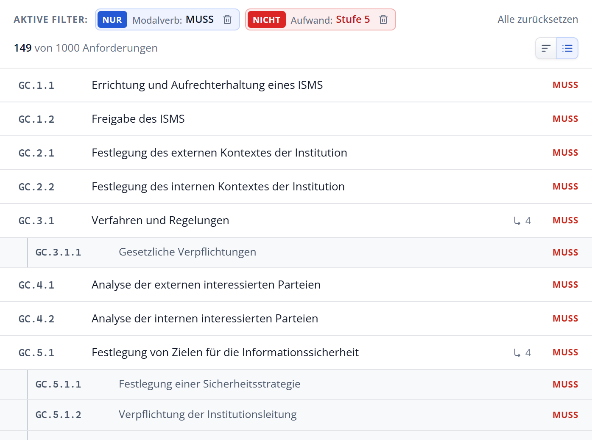
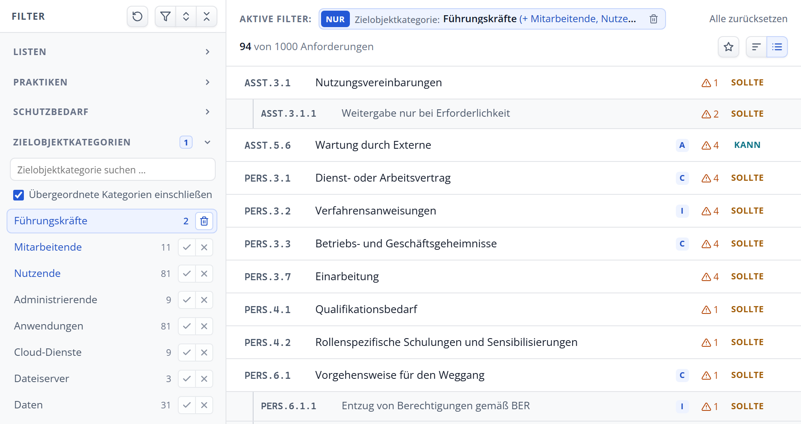

# Suchen und filtern {#kap-suchen-filtern}

Suche und Filter lassen sich beliebig kombinieren. Sie folgen in allen Bereichen derselben Regel und eignen sich für eine grobe thematische Eingrenzung ebenso wie für sehr genaue Abfragen.

{width=70%}

/// figure-caption
    attrs: {id: fig-filter}
Kombinierte Filter
///

## Volltextsuche

Das Suchfeld in der Kopfzeile durchsucht Kennungen, Titel, Anforderungstexte, Hilfestellungen, Gefährdungen, Tags und Quellkataloge. Groß- und Kleinschreibung spielen keine Rolle.

- **Während der Eingabe:** Die Trefferliste aktualisiert sich, während Sie tippen.
- **Mehrere Suchwörter:** Durch Leerzeichen getrennte Wörter müssen alle vorkommen, in beliebiger Reihenfolge.
- **Genaue Wortfolge:** In Anführungszeichen gesetzt, etwa `"Security by Design"`, wird genau diese Wortfolge gesucht.
- **Tastatur:** `Strg + K` (macOS: `⌘ + K`) oder `/` setzt den Cursor ins Suchfeld. `Esc` im Suchfeld leert die Suche und verlässt das Feld; andere Filter bleiben bestehen.

## Filter setzen

Jeder Wert in der Filterleiste hat eigene Schaltflächen:

| Aktion | Wirkung |
| :--- | :--- |
| **Klick auf den Wert** oder **✓** | **Einschließen (NUR):** zeigt nur Anforderungen mit diesem Wert. |
| **✕** | **Ausschließen (NICHT):** blendet Anforderungen mit diesem Wert aus. |
| **Papierkorb** oder erneuter Klick auf den Wert | Hebt den Filter für diesen Wert wieder auf. |

Die Zahl neben jedem Wert nennt, wie viele Anforderungen diesen Wert haben, unter Berücksichtigung aller Filter in den **anderen** Bereichen. So sehen Sie vor dem Klick, wie viele Treffer ein zusätzlicher Wert bringen würde.

> [!TIP]
> Das **Trichter-Symbol** oben in der Filterleiste blendet alle Werte ohne Treffer aus. Die Filterleiste zeigt dann nur noch, was zu den übrigen Filtern tatsächlich passt.

## Die Filterlogik

Für alle Bereiche gilt dieselbe Regel:

- **Innerhalb eines Bereichs: oder.** Mehrere mit **✓** gewählte Werte im selben Bereich erweitern die Treffer. Es genügt, wenn einer der Werte zutrifft, z. B. `MUSS` oder `SOLLTE`.
- **Zwischen den Bereichen: und.** Werte aus verschiedenen Bereichen müssen alle zutreffen, z. B. `MUSS` und `Aufwand Stufe 2` und Praktik `DEV`.
- **✕ schließt immer aus.** Eine Anforderung mit einem ausgeschlossenen Wert erscheint nie, auch wenn andere Werte passen.

| Gesetzte Filter | Angezeigte Anforderungen |
| :--- | :--- |
| ✓ MUSS, ✓ SOLLTE | alle Anforderungen mit MUSS oder SOLLTE |
| ✓ MUSS, ✓ Aufwand Stufe 1 | Anforderungen mit MUSS, die zugleich Aufwandsstufe 1 haben |
| ✓ Praktik DEV, ✕ Tag VPN | alle Anforderungen der Praktik DEV ohne das Tag „VPN“ |
| ✓ Liste Audit 2026 | nur die Anforderungen der eigenen Liste „Audit 2026“ |

## Die Filterbereiche

| Bereich | Bedeutung |
| :--- | :--- |
| **Listen** | Eigene Sammlungen; zeigt nur die Anforderungen bestimmter Listen oder schließt sie aus. |
| **Praktiken** | Die Praktiken des Grundschutz++, z. B. *GC*, *ARCH*, *DEV* oder *BES*. |
| **Schutzbedarf** | Standard-Sicherheitsstufe oder Erhöhte Sicherheitsstufe. |
| **Zielobjektkategorien** | Worauf sich die Anforderung bezieht, z. B. *Anwendungen*, *Webbrowser* oder *Nutzende*. Eine Anforderung kann mehrere Zielobjektkategorien haben. |
| **Modalverben** | Verbindlichkeit: MUSS, SOLLTE oder KANN. |
| **Handlungswort** | Das Verb der geforderten Handlung, z. B. *dokumentieren*, *verankern* oder *prüfen*. |
| **Schutzziele** | Wirkung auf Vertraulichkeit, Integrität, Verfügbarkeit und Authentizität. |
| **Aufwand** | Aufwandsstufen 0 bis 5. |
| **Dokumentation** | Geforderte Dokumentationsvorgabe, z. B. *Sicherheitskonzept* oder *Freigabeplan*. |
| **Gefährdungen** | Zugeordnete elementare Gefährdungen G 0.1 bis G 0.47. |
| **Quellkataloge** | Teilkatalog des BSI, aus dem die Anforderung stammt. |
| **Tags** | Schlagwörter aus dem kontrollierten Vokabular des BSI. |
| **Änderungen** | Nur im Vergleichsmodus: neue, geänderte oder gelöschte Anforderungen. |

## Zielobjektkategorien mit übergeordneten Kategorien

Die Zielobjektkategorien des BSI sind hierarchisch geordnet. *Führungskräfte* etwa gehören zu den *Mitarbeitenden*, diese wiederum zu den *Nutzenden*. Was für Mitarbeitende gefordert ist, gilt damit auch für Führungskräfte.

Mit der Option **Übergeordnete Kategorien einschließen** unter dem Suchfeld der Zielobjektkategorien berücksichtigt der Filter diese Hierarchie:

- Wählen Sie *Führungskräfte*, zeigt die Liste auch alle Anforderungen an *Mitarbeitende* und *Nutzende*.
- Die einbezogenen Kategorien stehen in blauer Schrift direkt unter der gewählten, ohne selbst ausgewählt zu sein. Ein Tooltip nennt, über welche Kategorie sie einbezogen sind.
- Der Filter-Chip nennt sie in Klammern: *Zielobjektkategorie: Führungskräfte (+ Mitarbeitende, Nutzende)*.
- Ausschlüsse (✕) gelten immer nur für die ausgeschlossene Kategorie selbst.
- Die Option wird im Browser gespeichert. **Alle Filter zurücksetzen** hebt die Auswahl auf, lässt die Option aber eingeschaltet.

{width=100%}

/// figure-caption
    attrs: {id: fig-filter-zielobjekte}
Filter nach Zielobjektkategorie
///

## Schutzziele filtern

Die Schutzziele Vertraulichkeit, Integrität, Verfügbarkeit und Authentizität haben je eine dreistufige Skala:

| Symbol | Stufe | Bedeutung |
| :---: | :---: | :--- |
| ○○ | 0 | keine Wirkung auf dieses Schutzziel |
| ●○ | 1 | die Anforderung wirkt auf das Schutzziel hin |
| ●● | 2 | das Schutzziel steht im Zentrum der Anforderung |

Ein Klick auf eine Stufe filtert danach, ein Rechtsklick (oder die Kontextmenü-Taste) schließt sie aus. Wählen Sie z. B. bei der Vertraulichkeit `●○` und `●●`, erhalten Sie alle Anforderungen mit Wirkung auf die Vertraulichkeit.

## Aktive Filter

Über der Liste fassen Chips alle gesetzten Filter zusammen, ein Chip je Bereich und Art:

- **NUR** *Bereich: Werte* – eingeschlossene Werte; mehrere Werte sind mit „oder“ verknüpft.
- **NICHT** *Bereich: Werte* – ausgeschlossene Werte.
- **Papierkorb am Chip:** entfernt alle Werte dieses Chips auf einmal.
- **Alle zurücksetzen:** hebt alle Filter und die Suche auf.

Findet sich keine passende Anforderung, zeigt die Liste einen Hinweis mit **Filter zurücksetzen**.

## Filtern aus der Detailansicht

Viele Angaben in der Detailansicht sind gestrichelt unterstrichen. Ein Klick darauf setzt den Wert als Filter, ein weiterer Klick hebt ihn wieder auf. Das gilt für Zielobjektkategorien (auch die übergeordneten), Modalverb und Handlungswort (im Klappbereich unter dem Anforderungstext), Schutzziele, Aufwand, Dokumentation, Gefährdungen, Quellkatalog und Tags. Die Hinweise im Kopfbereich (Art, Modalverb, Schutzbedarf, Anzahlen) dienen der Orientierung und sind nicht anklickbar; nach ihnen filtern Sie über die Filterleiste.
