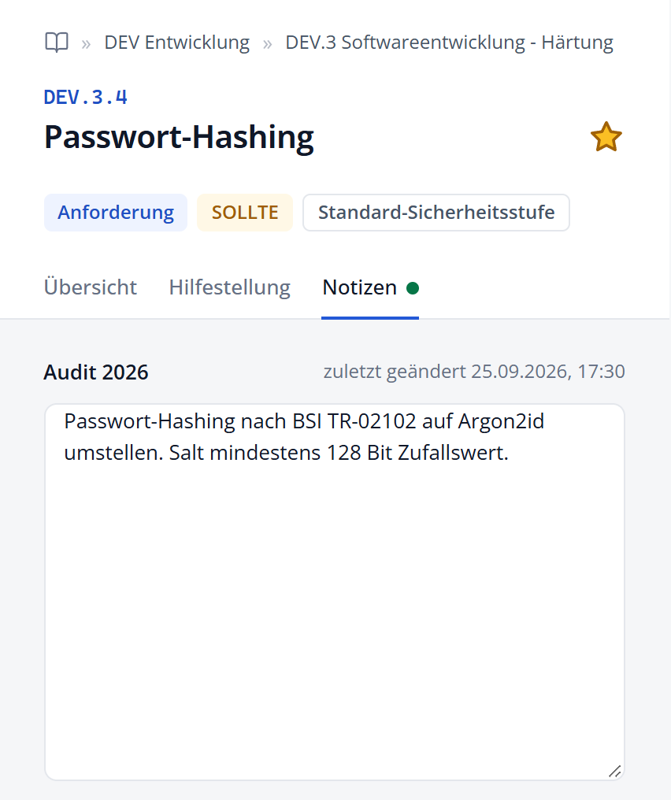
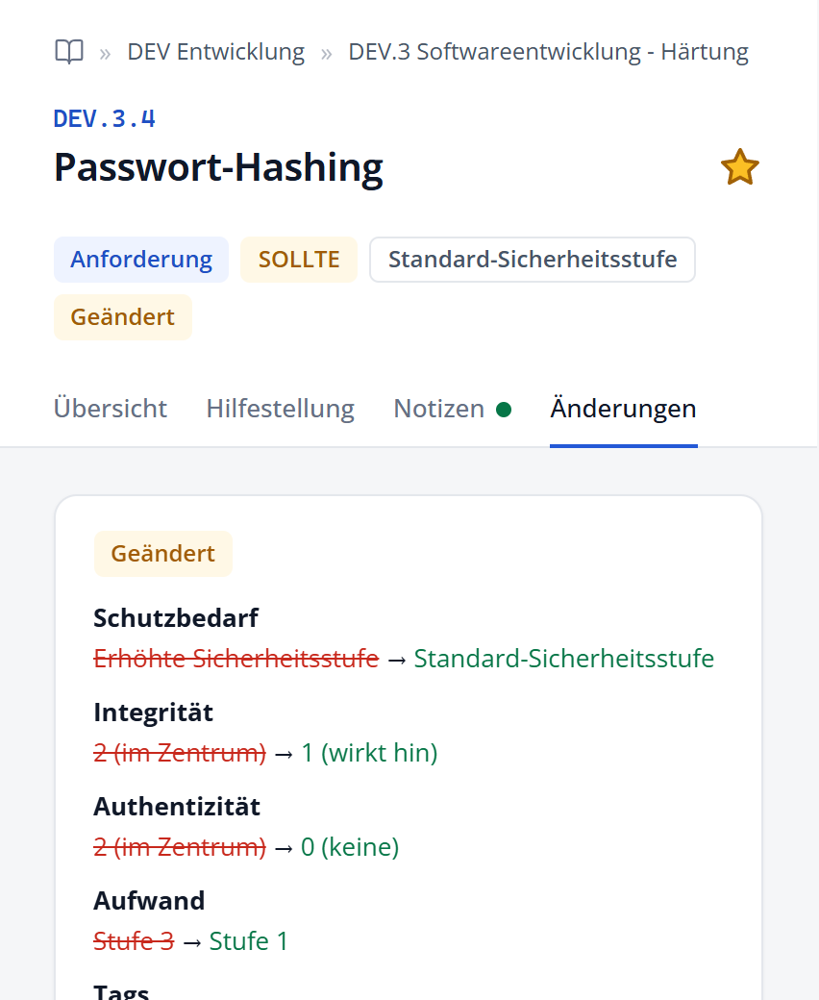

# Die Detailansichten

Die Detailansicht auf der rechten Seite des Bildschirms bereitet alle Fach- und Metadaten des Katalogs übersichtlich auf. Sie umfasst die allgemeine **Katalogübersicht**, die vollständige **Anforderungsansicht** mit ihren fachlichen Reitern sowie den interaktiven **Wortvergleich** im Vergleichsmodus.

## Katalogübersicht

Solange keine konkrete Anforderung ausgewählt ist – oder wenn Sie in der Pfadleiste auf das **Buch-Symbol** am Anfang klicken –, zeigt die Detailansicht eine umfassende Übersicht über den geladenen Katalog und seine übergeordneten NIST-OSCAL-Metadaten. Dazu gehören Versionsstand, gesetzliche Grundlagen, Herausgeberangaben des BSI sowie offizielle Dokumentenverweise.

## Aufbau der Anforderungsansicht

Sobald Sie eine Anforderung in der Baumansicht oder der Trefferliste auswählen, wechselt die Detailansicht in den Anforderungsmodus. Der Kopfbereich fasst die Einordnung und Kernattribute zusammen:

- **Pfadleiste (Breadcrumb):** Führt vom Buch-Symbol (Katalogübersicht) über Praktik und Teilbereich bis zur Anforderung. Jeder Knoten lässt sich anklicken, um in der Hierarchie zurückzuspringen.
- **Kennung und Titel:** Eindeutige Kennzeichnung der Anforderung (z. B. `DEV.3.1`) und ihr offizieller Titel.
- **Stern-Symbol:** Fügt die Anforderung mit einem Klick zur aktuellen Arbeitsliste hinzu oder entfernt sie wieder (Gelb = in aktiver Liste, Grau = in anderer Liste, Umriss = in keiner Liste).
- **Status-Badges:** Kennzeichnen Art (*Anforderung* oder *Unteranforderung*), Verbindlichkeit (*MUSS*, *SOLLTE*, *KANN*), Schutzbedarf (*Standard* oder *Erhöht*) und im Vergleichsmodus den Änderungsstatus (*Neu*, *Geändert*, *Gelöscht*).
- **Reiterleiste (Tabs):** Erlaubt den schnellen Wechsel zwischen *Übersicht*, *Hilfestellung*, *Notizen* und im Vergleichsmodus *Änderungen*.

## Registerkarte „Übersicht“

Die Registerkarte **Übersicht** bündelt alle operativen Vorgaben der gewählten Anforderung.

{width=42%}

/// figure-caption
    attrs: {id: fig-detailansicht}
Detailansicht einer Anforderung mit Breadcrumb, Metadaten und Reiter „Übersicht“ (am Beispiel DEV.3.1 Replay-Angriffe)
///

Die Übersicht gliedert sich in folgende funktionale Abschnitte:

- **Anforderungstext:** Der normative Kern der Anforderung. Das maßgebliche Modalverb ist farbig hervorgehoben; Parameterplatzhalter sind mit konkreten Werten aufgelöst.
- **Schutzziele:** Zwei Punkte symbolisieren die Schutzwirkung auf Vertraulichkeit (C), Integrität (I), Verfügbarkeit (A) und Authentizität (Au) (●● = im Zentrum, ●○ = wirkt hin, ○○ = keine Zuordnung).
- **Handlung und Dokumentation:** Das Handlungswort beschreibt die auszuführende Tätigkeit; die Dokumentationsvorgabe bestimmt den geforderten Nachweis.
- **Gefordertes Ergebnis & Spezifikation:** Definiert den verbindlichen Endzustand der Umsetzung.
- **Aufwandsstufe:** Ein fünfstufiger Farbbalken verdeutlicht den geschätzten Realisierungsaufwand nach BSI-Definition (Stufe 0 = zwingend umzusetzen / Aufwand nicht bewertet).
- **Tags & Gefährdungen:** Thematische Schlagwörter und abgewendete BSI-Gefährdungen (G 0.1 bis G 0.47), die direkt als Klickfilter nutzbar sind.
- **Definitionen (i-Symbol):** Neben Handlung, Dokumentation, Aufwand und Schutzzielen klappt ein Klick auf das Info-Symbol die offizielle BSI-Definition (inkl. Synonymen und Vorgaben) auf.
- **UUID:** Am Ende der Übersicht steht die eindeutige, unveränderliche Kennung der Anforderung im NIST-OSCAL-Datenbestand.

## Registerkarte „Hilfestellung“

Reicht der normative Anforderungstext für die praktische Ausgestaltung nicht aus, verweist die Registerkarte **Hilfestellung** auf praxisnahe Empfehlungen des BSI. Hier finden sich Erläuterungen zur Implementierung, empfohlene Werkzeuge (z. B. für Software Composition Analysis) sowie Querverweise auf Technische Richtlinien (wie BSI TR-03183 oder TR-02102):

{width=26%}

/// figure-caption
    attrs: {id: fig-detail-hilfestellung}
Registerkarte „Hilfestellung“ mit Verweisen auf Technische Richtlinien
///

## Registerkarte „Notizen“

Direkt an jeder Anforderung können Sie individuelle Notizen und Umsetzungskommentare erfassen:

{width=26%}

/// figure-caption
    attrs: {id: fig-detail-notizen}
Registerkarte „Notizen“ mit Textfeld, Statuspunkt und Zeitstempel
///

- **Notizen schreiben:** Eingaben werden direkt in der aktuell **aktiven Liste** gespeichert.
- **Notizen anderer Listen einsehen:** Über das Auswahlmenü können Notizen aus anderen Listen schreibgeschützt eingesehen werden.
- **Statuspunkt am Reiter:** Ein grüner Punkt signalisiert eine Notiz in der aktiven Liste; ein grauer Punkt weist auf Notizen in anderen Listen hin.
- **Zeitstempel:** Dokumentiert das Datum der letzten Bearbeitung.

*(Eine ausführliche Beschreibung der Listenverwaltung finden Sie im Kapitel **Listen und Notizen**.)*

## Registerkarte „Änderungen“ (Vergleichsmodus)

Befindet sich der Explorer im Vergleichsmodus, wird bei allen geänderten Anforderungen automatisch der Reiter **Änderungen** eingeblendet:

{width=38%}

/// figure-caption
    attrs: {id: fig-detail-aenderungen}
Registerkarte „Änderungen“ mit direkter Feld-Gegenüberstellung und Wortvergleich
///

Dieser Reiter bietet zwei wesentliche Analysewerkzeuge:

1. **Gegenüberstellung veränderter Eigenschaften:** Zeigt übersichtlich alle modifizierten Attribute (z. B. ein geändertes Modalverb von `SOLLTE` auf `MUSS`, angepasste Schutzziele oder geänderte Gefährdungen).
2. **Wortvergleich (Word-Diff):** Im Anforderungstext und in der Hilfestellung werden gestrichene Textstellen rot durchgestrichen und neu hinzugekommene Formulierungen grün hervorgehoben.
