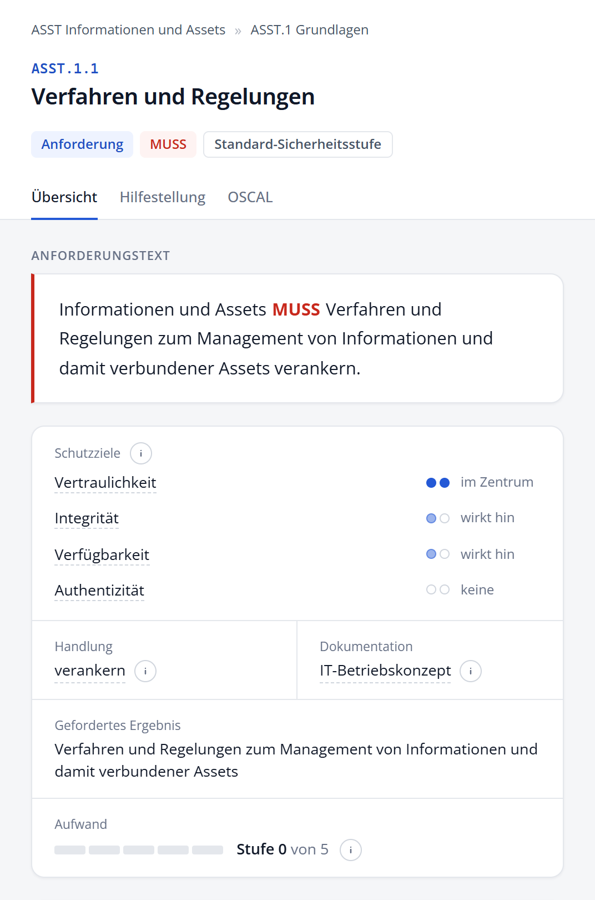

# Eine Anforderung lesen

Die Detailansicht zeigt alle Angaben, die das BSI zu einer Anforderung veröffentlicht.

## Kopf der Detailansicht

Unter dem Breadcrumb stehen Kennung und Titel der Anforderung. Die Kennzeichnungen darunter zeigen:

- die Art: **Anforderung** oder **Unteranforderung**,
- das **Modalverb** (MUSS, SOLLTE, KANN),
- den **Schutzbedarf** (Standard-Sicherheitsstufe oder erhöhte Sicherheitsstufe),
- im Vergleichsmodus den Änderungsstatus.

Fahren Sie mit der Maus über das Modalverb oder den Schutzbedarf, um die Definition des BSI zu sehen.

## Registerkarte „Übersicht“

**Anforderungstext.** Der Text der Anforderung, das Modalverb ist farbig hervorgehoben. Enthält der Text Parameter, sind ihre Werte in eckigen Klammern eingesetzt.

**Schutzziele.** Für Vertraulichkeit, Integrität, Verfügbarkeit und Authentizität zeigen zwei Punkte, wie stark die Anforderung darauf wirkt: zwei kräftig blaue Punkte bedeuten „im Zentrum“, ein blasser Punkt „wirkt hin“, keine gefüllten Punkte „keine“. Hat das BSI keine Schutzziele zugeordnet, etwa bei vielen Governance-Anforderungen, steht dort „Keine Zuordnung im Katalog“.

**Handlung und Dokumentation.** Das Handlungswort beschreibt, was zu tun ist, die Dokumentationsvorgabe, in welchem Dokument das Ergebnis festgehalten wird.

**Gefordertes Ergebnis und Spezifikation.** Was am Ende vorliegen muss, gegebenenfalls mit näherer Spezifikation.

**Aufwand.** Ein Balken aus fünf Segmenten zeigt die Aufwandsstufe, von grün (gering) bis rot (hoch). Stufe 0 bedeutet nach der Definition des BSI nicht „kein Aufwand“, sondern: Der Aufwand wird nicht bewertet, weil die Anforderung in jedem Fall umzusetzen ist.

**Tags.** Schlagwörter des BSI zur thematischen Einordnung.

**Elementare Gefährdungen.** Die Gefährdungen, denen die Anforderung entgegenwirkt, mit Kennung und Bezeichnung.

**Unteranforderungen.** Bei Anforderungen mit Unteranforderungen deren Liste. Ein Klick öffnet die Unteranforderung.

### Definitionen nachschlagen

Neben Handlung, Dokumentation, Aufwand, Schutzzielen und Tags steht ein kleiner Info-Button **i**. Ein Klick darauf klappt die Definition des BSI auf, bei Handlungswörtern mit Synonymen, bei Dokumentationsvorgaben mit Kategorie und Zielgruppe. Ein weiterer Klick klappt sie wieder zu.

### Mit einem Klick filtern

Gestrichelt unterstrichene Angaben sind Filter: Ein Klick zeigt alle Anforderungen mit derselben Eigenschaft. Mehr dazu im Kapitel **Suchen und filtern**.

## Registerkarte „Hilfestellung“

Die Erläuterungen des BSI zur Umsetzung der Anforderung. Nicht jede Anforderung hat eine Hilfestellung.

## Registerkarte „Änderungen“

Erscheint nur im Vergleichsmodus. Sie zeigt, was sich an der Anforderung gegenüber der Vergleichsversion geändert hat. Bei Texten sind entfernte Wörter durchgestrichen und neue Wörter hervorgehoben.

## Registerkarte „OSCAL“

Die technischen Rohdaten der Anforderung, wie sie im OSCAL-Katalog stehen: alle Eigenschaften mit ihren Namensräumen sowie die eindeutige Kennung (UUID). Diese Ansicht ist vor allem für die Weiterverarbeitung in anderen Werkzeugen gedacht.
