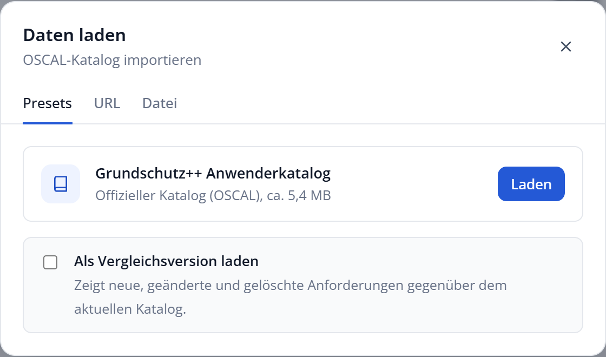
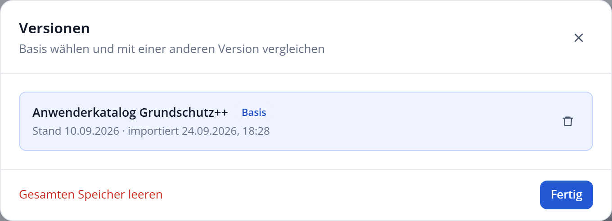

# Kataloge laden und vergleichen

Der Explorer kann mehrere Stände des Grundschutz++-Katalogs speichern und jeweils zwei davon miteinander vergleichen.

## Daten laden

Über **Daten laden** in der Kopfzeile öffnen Sie den Dialog zum Laden eines Katalogs. Er bietet drei Wege:

| Registerkarte | Verwendung |
| :--- | :--- |
| Presets | Lädt den aktuellen offiziellen Grundschutz++-Anwenderkatalog aus der Stand-der-Technik-Bibliothek des BSI. |
| URL | Lädt einen OSCAL-Katalog von einer beliebigen Internetadresse. |
| Datei | Importiert einen OSCAL-Katalog als JSON-Datei von Ihrem Rechner, per Auswahl oder durch Ablegen mit der Maus. |

Ist der offizielle Katalog beim BSI gerade nicht erreichbar, verwendet der Explorer die mitgelieferte Kopie.

Nach dem Laden setzt der Explorer die Ansicht zurück: Alle Filter werden aufgehoben und alle Bereiche eingeklappt, damit Sie im neuen Katalog neu beginnen.

> [!IMPORTANT]
> Der Explorer versteht Kataloge im Format OSCAL, wie sie das BSI veröffentlicht. Andere Dateien lehnt er mit einer Fehlermeldung ab.

## Versionen verwalten

Jeder geladene Katalog wird als Version in Ihrem Browser gespeichert. Der Dialog **Versionen** listet sie mit Titel, Stand und Importdatum. Pro Version stehen zur Wahl:

- **Als Basis:** Diese Version wird zum aktuell angezeigten Katalog.
- **Vergleichen:** Diese Version wird mit der Basis verglichen.
- **Vergleich lösen:** Beendet den Vergleich.
- **Papierkorb:** Löscht die Version aus dem Speicher.

**Gesamten Speicher leeren** entfernt alle Versionen und Einstellungen aus Ihrem Browser.

## Zwei Versionen vergleichen

Es gibt zwei Wege in den Vergleichsmodus:

1. Im Dialog **Versionen** bei einer gespeicherten Version **Vergleichen** wählen.
2. Beim Laden eines neuen Katalogs im Dialog **Daten laden** die Option **Als Vergleichsversion laden** aktivieren.

Im Vergleichsmodus erscheint unter der Kopfzeile ein Hinweisbalken mit der Zahl der neuen, geänderten und gelöschten Anforderungen. Zusätzlich:

- In der Liste sind betroffene Anforderungen mit **Neu**, **Geändert** oder **Gelöscht** gekennzeichnet.
- In der Filterleiste erscheint der Bereich **Änderungen**. Damit zeigen Sie zum Beispiel nur die geänderten Anforderungen.
- In der Detailansicht zeigt die Registerkarte **Änderungen**, was sich im Einzelnen geändert hat.
- Die Übersicht einer Praktik oder eines Teilbereichs nennt die Zahl der Änderungen darin.

Mit **Vergleich beenden** im Hinweisbalken kehren Sie zur normalen Ansicht zurück.

> [!TIP]
> Wenn das BSI einen neuen Stand des Katalogs veröffentlicht, laden Sie ihn als Vergleichsversion. So sehen Sie sofort, welche Anforderungen Sie in Ihrer Umsetzung überprüfen sollten.
