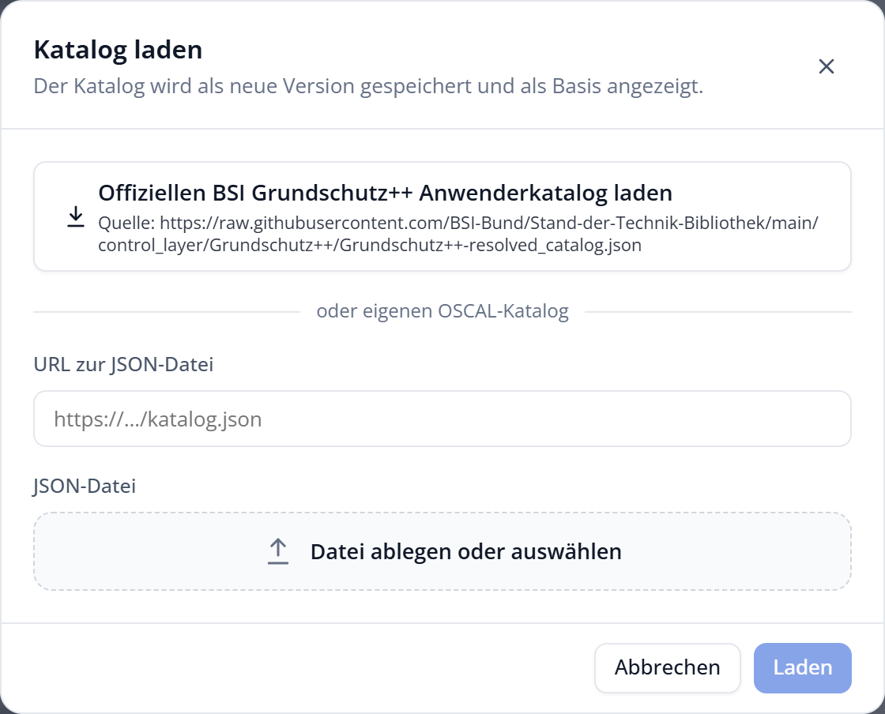
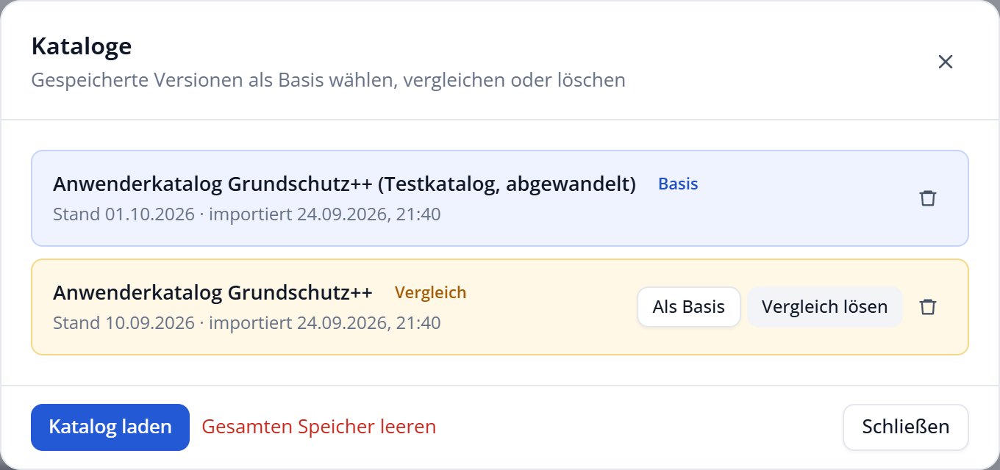

# Kataloge laden und vergleichen

Der Explorer kann mehrere Stände des Grundschutz++-Katalogs speichern und jeweils zwei davon miteinander vergleichen.

## Kataloge laden

Über **Kataloge → Katalog laden** in der Kopfzeile öffnen Sie den Dialog zum Laden eines Katalogs. Auf der Startseite erreichen Sie ihn über **Von URL laden**. Es gibt drei Wege:

| Weg | Verwendung |
| :--- | :--- |
| Offiziellen BSI Grundschutz++ Anwenderkatalog laden | Lädt sofort den aktuellen offiziellen Katalog aus der Stand-der-Technik-Bibliothek des BSI. |
| URL zur JSON-Datei | Lädt einen OSCAL-Katalog von einer beliebigen Internetadresse. |
| JSON-Datei | Lädt einen OSCAL-Katalog von Ihrem Rechner, per Auswahl oder durch Ablegen mit der Maus. |

Für URL und Datei geben Sie die Quelle an und bestätigen mit **Laden**. Wählen Sie eine Datei, wird eine eingegebene URL verworfen und umgekehrt. Ist der offizielle Katalog beim BSI gerade nicht erreichbar, verwendet der Explorer die mitgelieferte Kopie.

Ist ein Katalog mit identischem Inhalt bereits geladen, legt der Explorer ihn nicht erneut an und weist im Dialog **Katalog laden** darauf hin. Andernfalls wird der geladene Katalog als neue Version gespeichert und als Basis angezeigt; ein laufender Vergleich endet dabei. Danach kehrt der Explorer zur Liste der Kataloge zurück, sodass Sie zum Beispiel gleich einen Vergleich starten können. Laden Sie über die Startseite, gelangen Sie direkt in den Katalog. Der Explorer setzt außerdem die Ansicht zurück: Alle Filter werden aufgehoben und alle Bereiche eingeklappt, damit Sie im neuen Katalog neu beginnen.

> [!IMPORTANT]
> Der Explorer versteht Kataloge im Format OSCAL, wie sie das BSI veröffentlicht. Andere Dateien lehnt er mit einer Fehlermeldung ab.

## Versionen verwalten

Jeder geladene Katalog wird als Version in Ihrem Browser gespeichert. Der Dialog **Kataloge** in der Kopfzeile listet sie mit Titel, Stand und Importdatum; solange keiner gespeichert ist, steht dort „Keine Kataloge gespeichert.“ Pro Version stehen zur Wahl:

- **Als Basis:** Diese Version wird zum aktuell angezeigten Katalog.
- **Vergleichen:** Diese Version wird mit der Basis verglichen.
- **Vergleich lösen:** Beendet den Vergleich.
- **Papierkorb:** Löscht die Version aus dem Speicher.

Alle Versionen und Einstellungen zusammen entfernen Sie in der **Datenschutzerklärung** (Fußzeile) mit **Alle lokal gespeicherten Daten löschen**.

## Zwei Versionen vergleichen

Laden Sie zunächst beide Stände, zum Beispiel den offiziellen Katalog und eine ältere Version als Datei. Wählen Sie dann unter **Kataloge** den neueren Stand mit **Als Basis** und beim älteren Stand **Vergleichen**.

Im Vergleichsmodus erscheint unter der Kopfzeile ein Hinweisbalken mit der Zahl der neuen, geänderten und gelöschten Anforderungen. Zusätzlich:

- In der Liste sind betroffene Anforderungen mit **Neu**, **Geändert** oder **Gelöscht** gekennzeichnet.
- In der Filterleiste erscheint der Bereich **Änderungen**. Damit zeigen Sie zum Beispiel nur die geänderten Anforderungen.
- In der Detailansicht zeigt die Registerkarte **Änderungen**, was sich im Einzelnen geändert hat.
- Die Übersicht einer Praktik oder eines Teilbereichs nennt die Zahl der Änderungen darin.

Mit **Vergleich beenden** im Hinweisbalken kehren Sie zur normalen Ansicht zurück.

> [!TIP]
> Wenn das BSI einen neuen Stand des Katalogs veröffentlicht, laden Sie ihn als Vergleichsversion. So sehen Sie sofort, welche Anforderungen Sie in Ihrer Umsetzung überprüfen sollten.
