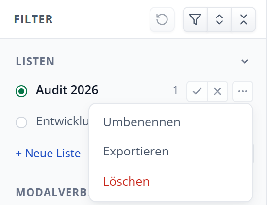

# Listen und Notizen

Mit eigenen Listen stellen Sie Anforderungen flexibel für konkrete Arbeitsschritte zusammen – etwa für anstehende Sicherheitsaudits, Entwicklungs-Sprints, Dienstleisterüberprüfungen oder Besprechungen. Jede Anforderung in einer Liste kann mit individuellen Notizen versehen werden.

{width=27%}

/// figure-caption
    attrs: {id: fig-listen}
Listenbereich in der Filterleiste mit aktiver Liste, Trefferzahlen und Aktionen
///

## Listen anlegen und aktivieren

Der Abschnitt **Listen** steht ganz oben in der Filterleiste:

- **Neue Liste anlegen:** Klicken Sie auf **„+ Neue Liste“**, tragen Sie einen aussagekräftigen Namen ein (z. B. *Audit 2026* oder *Entwicklungsteam*) und bestätigen Sie mit der Eingabetaste.
- **Aktive Liste festlegen:** Klicken Sie auf den runden Auswahlknopf oder auf den Listennamen. Ein **grün leuchtender Punkt** signalisiert, dass diese Liste aktiv ist. Stern-Klicks und geschriebene Notizen beziehen sich stets auf die aktive Liste. Sobald Listen bestehen, ist immer genau eine davon aktiv; Sie wechseln sie, indem Sie eine andere Liste wählen.
- **Listenmenü (Drei Punkte):** Über das Symbol **···** rechts neben dem Listennamen können Sie eine Liste umbenennen, einzeln als JSON exportieren oder löschen.

## Listen als Filter nutzen

Listen verhalten sich in der Filterleiste wie jede andere Facette:

- **✓ (Nur diese Liste):** Schränkt die Trefferliste auf die Anforderungen dieser Liste ein.
- **✕ (Liste ausschließen):** Blendet alle Anforderungen aus, die in dieser Liste stehen.
- **Kombinationen:** Mehrere Listen mit **✓** zeigen alle Anforderungen, die in mindestens einer dieser Listen vorkommen (ODER-Verknüpfung).
- **Ausschluss der aktiven Liste:** Schließen Sie die aktive Liste mit **✕** aus, wird automatisch eine andere, nicht ausgeschlossene Liste aktiv. Sind alle Listen ausgeschlossen, bleibt die bisherige aktiv.

## Anforderungen in Listen aufnehmen (Stern-Symbol)

Im Kopf der Detailansicht jeder Anforderung befindet sich rechts neben dem Titel ein **Stern-Symbol**:

- **Gelber Stern:** Die Anforderung ist in der aktuell **aktiven Liste** enthalten. Ein Klick auf den Stern entfernt sie wieder.
- **Grauer Stern:** Die Anforderung ist in mindestens einer **anderen Liste** enthalten, jedoch nicht in der aktiven Liste. Ein Klick auf den Stern nimmt die Anforderung zusätzlich in die aktive Liste auf (der Stern wird gelb).
- **Leerer Stern (Umriss):** Die Anforderung ist in noch keiner Liste hinterlegt. Ein Klick nimmt sie in die aktive Liste auf.

> [!TIP]
> Gibt es noch keine Liste und Sie klicken auf einen Stern oder schreiben eine Notiz, legt der Explorer automatisch die Liste **Merkliste** an, aktiviert diese und fügt die Anforderung dort ein.

Auch in der mittleren Trefferliste signalisiert das Stern-Symbol auf einen Blick, ob eine Anforderung zu einer Liste gehört.

## Notizen erfassen und verwalten

Wechseln Sie in der Detailansicht auf den Reiter **Notizen**:

- **Notiz verfassen:** Solange eine Liste aktiv ist, können Sie im Notizfeld beliebig Text eingeben. Die Eingabe wird sofort automatisch lokal in Ihrem Browser gespeichert – eine manuelle Speichern-Schaltfläche ist nicht erforderlich.
- **Notizen anderer Listen einsehen:** Ist eine Anforderung in mehreren Listen enthalten, können Sie über die Auswahlliste oberhalb des Textfelds zwischen den Notizen der verschiedenen Listen umschalten. Notizen inaktiver Listen werden schreibgeschützt angezeigt.
- **Statuspunkt am Reiter:** Ein grüner Punkt signalisiert eine Notiz in der aktiven Liste; ein grauer Punkt weist auf Notizen in anderen Listen hin (ohne Punkt: keine Notiz vorhanden).
- **Bearbeitungsstand:** Unter der Überschrift dokumentiert ein Zeitstempel das Datum und die Uhrzeit der letzten Textänderung.
- **Lokale Vertraulichkeit:** Alle Notizen werden ausschließlich in der lokalen Browser-Datenbank (IndexedDB) auf Ihrem Endgerät gespeichert. Es findet keinerlei Übertragung an externe Server oder Cloud-Dienste statt.

## Listen sichern und austauschen (Export und Import)

Um eigene Listen auf ein anderes Gerät zu übertragen, für Kolleginnen und Kollegen bereitzustellen oder vor dem Löschen des Browser-Speichers als Backup abzulegen, bietet der Explorer eine JSON-Export- und Importfunktion:

- **Einzelne Liste exportieren:** Klicken Sie im Menü **···** der gewünschten Liste auf **Exportieren**.
- **Alle Listen sichern:** Ein Klick auf das Ordner-Symbol neben **„+ Neue Liste“** lädt alle Listen samt Notizen in einer einzigen JSON-Datei herunter.
- **Listen importieren:** Klicken Sie auf das Ordner-Symbol und wählen Sie eine zuvor exportierte JSON-Datei aus.
- **Namenskonflikte intelligent lösen:** Existiert im Browser bereits eine Liste mit demselben Namen, bietet der Explorer drei Optionen:
  - **Zusammenführen (Merge):** Führt beide Listen zusammen. Neue Einträge werden ergänzt. Weichen Notizen derselben Anforderung voneinander ab, werden beide Fassungen durch eine Trennlinie sauber zusammengeführt – es geht kein Text verloren!
  - **Kopie anlegen:** Erstellt eine neue Liste mit fortlaufender Nummerierung (z. B. *Audit 2026 (2)*).
  - **Überspringen:** Behält die bestehende lokale Liste unverändert bei.

> [!TIP]
> Die Exportdateien sind im standardisierten JSON-Format strukturiert. Sie lassen sich bei Bedarf mit gängigen Skriptsprachen weiterverarbeiten oder in Versionskontrollsystemen sichern.
