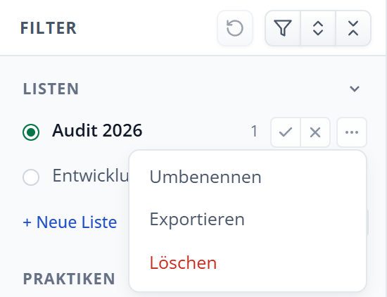
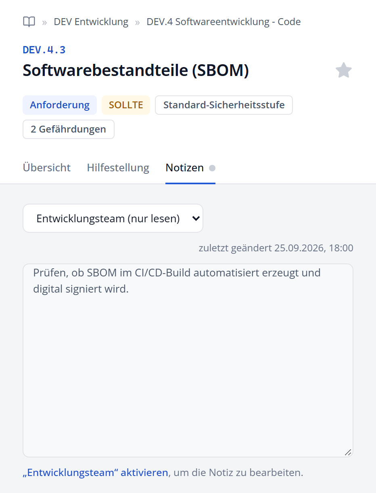

# Listen und Notizen {#kap-listen-notizen}

Mit eigenen Listen stellen Sie Anforderungen für einen bestimmten Zweck zusammen, etwa für ein Audit, einen Entwicklungs-Sprint, die Prüfung eines Dienstleisters oder eine Besprechung. Zu jeder Anforderung in einer Liste können Sie eine Notiz festhalten.

{width=30%}

/// figure-caption
    attrs: {id: fig-listen}
Listenbereich in der Filterleiste: aktive Liste, Trefferzahlen, Filterschaltflächen und Menü einer Liste
///

## Listen anlegen und aktivieren

Der Bereich **Listen** steht ganz oben in der Filterleiste:

- **Neue Liste:** Klicken Sie auf **„+ Neue Liste“**, geben Sie einen Namen ein (z. B. *Audit 2026*) und bestätigen Sie mit der Eingabetaste. **Esc** bricht ab.
- **Aktive Liste:** Klicken Sie auf den runden Auswahlknopf oder den Namen einer Liste. Ein grüner Punkt kennzeichnet die aktive Liste. Stern und Notizfeld wirken immer auf sie. Sobald Listen bestehen, ist genau eine davon aktiv.
- **Zahl hinter dem Namen:** die Anzahl der Anforderungen in der Liste.
- **Menü einer Liste (···):** Umbenennen, Exportieren oder Löschen. Enthält die Liste Einträge, fragt der Explorer vor dem Löschen nach und nennt, wie viele davon Notizen haben.

## Anforderungen aufnehmen: der Stern

Rechts neben dem Titel jeder Anforderung steht ein Stern. Seine Farbe zeigt, ob die Anforderung schon in einer Liste steht:

| Stern | Bedeutung | Klick auf den Stern |
| :---: | :--- | :--- |
| {width=9mm} | Die Anforderung steht in der **aktiven Liste**. | entfernt sie aus der aktiven Liste |
| {width=9mm} | Die Anforderung steht nur in einer **anderen Liste**. | nimmt sie zusätzlich in die aktive Liste auf |
| {width=9mm} | Die Anforderung steht in **keiner Liste**. | nimmt sie in die aktive Liste auf |

/// table-caption
    attrs: {id: tbl-stern}
Die drei Zustände des Sterns in der Detailansicht
///

Der Tooltip des Sterns nennt alle Listen, in denen die Anforderung steht. Hat die Anforderung in der aktiven Liste eine Notiz, fragt der Explorer vor dem Entfernen nach, weil die Notiz dabei gelöscht wird.

In der Liste der Anforderungen erscheinen Stern und Notizsymbol nur bei Anforderungen, die in einer Liste stehen: gelb bzw. grün für die aktive Liste, grau für eine andere Liste (siehe [Kapitel „Die Oberfläche im Überblick“](#kap-oberflaeche)).

> [!TIP]
> Gibt es noch keine Liste und Sie klicken auf einen Stern oder schreiben eine Notiz, legt der Explorer automatisch die Liste **Merkliste** an und macht sie zur aktiven Liste.

## Notizen

Notizen schreiben Sie in der Detailansicht im Reiter **Notizen** (siehe [Kapitel „Die Detailansicht“](#kap-detailansicht)):

- **Schreiben:** Die Eingabe wird automatisch in der aktiven Liste gespeichert. Schreiben Sie eine Notiz zu einer Anforderung, die noch nicht in der aktiven Liste steht, wird sie dabei aufgenommen.
- **Punkt am Reiter:** Grün bedeutet eine Notiz in der aktiven Liste, grau eine Notiz nur in einer anderen Liste, ohne Punkt gibt es keine Notiz.
- **Zeitstempel:** Datum und Uhrzeit der letzten Änderung.
- **Notizen anderer Listen:** Das Auswahlfeld über dem Notizfeld wechselt zu den Notizen anderer Listen. Diese sind nur lesbar; mit **„Liste“ aktivieren** unter dem Text machen Sie die Liste aktiv und können die Notiz bearbeiten.

{width=48%}

/// figure-caption
    attrs: {id: fig-detail-notizen-andere}
Notiz der nicht aktiven Liste „Entwicklungsteam“, nur lesbar
///

## Listen als Filter

Listen wirken in der Filterleiste wie jeder andere Filterbereich:

- **✓ (nur diese Liste):** zeigt nur die Anforderungen dieser Liste.
- **✕ (Liste ausschließen):** blendet alle Anforderungen dieser Liste aus.
- **Mehrere Listen mit ✓:** zeigt alle Anforderungen, die in mindestens einer dieser Listen stehen.
- **Aktive Liste ausschließen:** Schließen Sie die aktive Liste mit ✕ aus, wird eine andere, nicht ausgeschlossene Liste aktiv. Sind alle Listen ausgeschlossen, bleibt die bisherige aktiv.

## Listen sichern und austauschen

Mit Export und Import übertragen Sie Listen auf ein anderes Gerät, geben sie an Kolleginnen und Kollegen weiter oder sichern sie, bevor Sie den Browserspeicher leeren:

- **Eine Liste exportieren:** im Menü **···** der Liste auf **Exportieren** klicken. Der Explorer lädt eine JSON-Datei mit allen Einträgen und Notizen herunter.
- **Alle Listen sichern:** das Ordner-Symbol neben **„+ Neue Liste“** öffnet ein Menü; **Alle Listen sichern** lädt alle Listen in einer Datei herunter.
- **Listen importieren:** im selben Menü **Listen importieren …** wählen und eine zuvor exportierte JSON-Datei auswählen.

Gibt es eine importierte Liste bereits (gleicher Name, unabhängig von Groß- und Kleinschreibung), fragt der Explorer nach:

- **Zusammenführen:** Neue Einträge werden ergänzt. Unterscheiden sich die Notizen zu derselben Anforderung, bleiben beide erhalten, getrennt durch eine Trennlinie.
- **Als „Name (2)“ anlegen:** Die importierte Liste wird unter einem freien Namen zusätzlich angelegt.
- **Import abbrechen:** Der ganze Import wird abgebrochen, es wird nichts geändert.

> [!TIP]
> Die Exportdateien sind einfache JSON-Dateien. Sie lassen sich mit gängigen Werkzeugen weiterverarbeiten oder in einer Versionsverwaltung ablegen.
