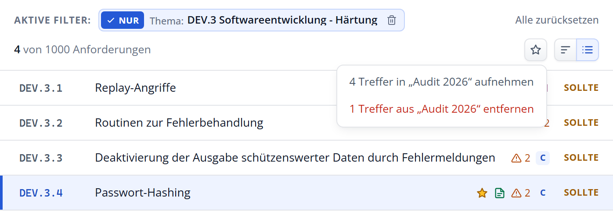

# Listen und Notizen {#kap-listen-notizen}

Mit eigenen Listen stellen Sie Anforderungen für einen bestimmten Zweck zusammen, etwa für ein Audit, einen Entwicklungs-Sprint, die Prüfung eines Dienstleisters oder eine Besprechung. Zu jeder Anforderung in einer Liste können Sie eine Notiz festhalten.

{width=30%}

/// figure-caption
    attrs: {id: fig-listen}
Listen in der Filterleiste
///

## Listen anlegen und verwalten

Der Bereich **Listen** steht ganz oben in der Filterleiste:

- **Neue Liste anlegen:** Klicken Sie auf **„+ Neue Liste“**, geben Sie einen Namen ein (z. B. *Audit 2026*) und bestätigen Sie mit der Eingabetaste (**Esc** bricht ab).
- **Aktive Liste:** Klicken Sie auf den Auswahlschalter oder den Namen einer Liste. Ein grüner Punkt kennzeichnet die aktive Liste. Stern und Notizfeld wirken immer auf sie. Sobald Listen bestehen, ist genau eine davon aktiv.
- **Zahl hinter dem Namen:** die Anzahl der Anforderungen in der jeweiligen Liste.
- **Menü einer Liste (···):** Umbenennen, Exportieren, Leeren oder Löschen. **Leeren** entfernt alle Einträge samt Notizen, die Liste selbst bleibt bestehen; der Eintrag erscheint nur, wenn die Liste Einträge hat. Vor dem Leeren und vor dem Löschen einer Liste mit Einträgen fragt der Explorer nach und nennt, wie viele davon Notizen haben.

> [!TIP]
> Gibt es noch keine Liste und Sie klicken auf einen Stern oder verfassen eine Notiz, legt der Explorer automatisch die Liste **Merkliste** an und macht sie zur aktiven Liste.

## Anforderungen aufnehmen: der Stern

Rechts neben dem Titel jeder Anforderung steht in der Detailansicht eine Stern-Schaltfläche. Ihre Farbgebung zeigt den aktuellen Status:

| Stern | Farbgebung | Bedeutung | Klick auf den Stern |
| :---: | :--- | :--- | :--- |
| {width=5mm} | **Gelb** (gefüllt) | Die Anforderung steht in der **aktiven Liste**. | Entfernt sie aus der aktiven Liste. |
| {width=5mm} | **Grau** (gefüllt) | Die Anforderung steht in mindestens einer **anderen Liste**. | Nimmt sie zusätzlich in die aktive Liste auf. |
| {width=5mm} | **Umriss** (ungefüllt) | Die Anforderung steht in **keiner Liste**. | Nimmt sie in die aktive Liste auf. |

Der Tooltip des Sterns nennt alle Listen, in denen die Anforderung verzeichnet ist. Hat die Anforderung in der aktiven Liste eine Notiz, fragt der Explorer vor dem Entfernen nach, da die Notiz dabei gelöscht würde.

In der Anforderungsliste (mittlere Spalte) zeigt ein kleiner gelber bzw. grauer Stern ebenfalls an, ob eine Anforderung in der aktiven oder einer anderen Liste steht.

## Alle Treffer auf einmal aufnehmen oder entfernen

Über der Anforderungsliste, links neben den Schaltflächen für die Ansicht, öffnet ein Stern ein Menü für alle aktuellen Treffer, also alle Anforderungen, die zu Suche und Filtern passen (unabhängig davon, ob sie im Baum aufgeklappt sind):

- **„Treffer in … aufnehmen“:** nimmt alle Treffer in die aktive Liste auf. Anforderungen, die dort schon stehen, bleiben samt Notiz unverändert. Ist kein Filter gesetzt, fragt der Explorer nach, bevor er alle Anforderungen des Katalogs aufnimmt.
- **„Treffer aus … entfernen“** (rot): entfernt alle Treffer aus der aktiven Liste. Der Eintrag erscheint nur, wenn Treffer in der Liste stehen. Haben davon welche eine Notiz, fragt der Explorer nach; Sie können dann auch nur die Einträge ohne Notiz entfernen.

{width=70%}

/// figure-caption
    attrs: {id: fig-treffer-in-liste}
Treffer in Liste übernehmen
///

> [!TIP]
> So dünnen Sie eine Liste gezielt aus: Filtern Sie auf die Liste (✓) und zusätzlich z. B. auf das Modalverb **KANN**, und entfernen Sie dann alle Treffer aus der Liste.

## Notizen

Notizen erfassen Sie in der Detailansicht im Reiter **Notizen**. Sie gehören immer zu einer bestimmten Liste und werden beim Tippen automatisch gespeichert. War die Anforderung noch nicht in der aktiven Liste, wird sie bei der Notizeingabe automatisch aufgenommen.

Ein farbiger Punkt am Reiter signalisiert den Notizen-Status:

| Markierung am Reiter | Zustand | Bedeutung | Bearbeitbarkeit |
| :---: | :--- | :--- | :--- |
| **Grüner Punkt** | Notiz in aktiver Liste | Zur Anforderung liegt eine Notiz in der derzeit aktiven Liste vor. | Im Textfeld bearbeitbar; der Zeitstempel unter dem Feld nennt die letzte Änderung. |
| **Grauer Punkt** | Notiz in anderer Liste | In der aktiven Liste gibt es keine Notiz, jedoch in mindestens einer anderen Liste. | Schreibgeschützt angezeigt; mit *„[Listenname]“ aktivieren* umschaltbar. |
| **Kein Punkt** | Keine Notiz vorhanden | In keiner Liste ist eine Notiz zu dieser Anforderung hinterlegt. | Das Textfeld ist leer; eine Eingabe legt die Notiz direkt in der aktiven Liste an. |

Gibt es Notizen in mehreren Listen, wechseln Sie über das Auswahlfeld über dem Textfeld zwischen diesen. Notizen inaktiver Listen sind schreibgeschützt, lassen sich aber über die Schaltfläche unter dem Hinweistext aktivieren und bearbeiten.

{width=48%}

/// figure-caption
    attrs: {id: fig-detail-notizen-andere}
Notiz einer anderen Liste
///

In der Anforderungsliste weist ein kleines Notizsymbol (grün für die aktive Liste, grau für eine andere Liste) direkt auf vorhandene Notizen hin.

## Listen als Filter

Listen wirken in der Filterleiste wie jeder andere Filterbereich:

- **✓ (nur diese Liste):** zeigt nur die Anforderungen dieser Liste.
- **✕ (Liste ausschließen):** blendet alle Anforderungen dieser Liste aus.
- **Mehrere Listen mit ✓:** zeigt alle Anforderungen, die in mindestens einer dieser Listen stehen (ODER-Verknüpfung).
- **Aktive Liste ausschließen:** Schließen Sie die aktive Liste mit ✕ aus, wird eine andere, nicht ausgeschlossene Liste aktiv. Sind alle Listen ausgeschlossen, bleibt die bisherige aktiv.

## Listen sichern und austauschen

Mit Export und Import übertragen Sie Listen auf ein anderes Gerät, geben sie an Kolleginnen und Kollegen weiter oder sichern sie, bevor Sie den Browserspeicher leeren:

- **Eine Liste exportieren:** im Menü **···** der Liste auf **Exportieren** klicken. Der Explorer lädt eine JSON-Datei mit allen Einträgen und Notizen herunter.
- **Alle Listen sichern:** das Ordner-Symbol neben **„+ Neue Liste“** öffnet ein Menü; **Alle Listen sichern** lädt alle Listen in einer Datei herunter.
- **Listen importieren:** im selben Menü **Listen importieren …** wählen und eine zuvor exportierte JSON-Datei auswählen. Ist die Datei keine gültige Exportdatei oder enthält sie keine Listen, meldet der Explorer das in einem Dialog und ändert nichts.

Gibt es eine importierte Liste bereits (gleicher Name, unabhängig von Groß- und Kleinschreibung), fragt der Explorer nach:

- **Zusammenführen:** Neue Einträge werden ergänzt. Unterscheiden sich die Notizen zu derselben Anforderung, bleiben beide erhalten, getrennt durch eine Trennlinie.
- **Als „Name (2)“ anlegen:** Die importierte Liste wird unter einem freien Namen zusätzlich angelegt.
- **Import abbrechen:** Der ganze Import wird abgebrochen, es wird nichts geändert.

> [!TIP]
> Die Exportdateien sind einfache JSON-Dateien. Sie lassen sich mit gängigen Werkzeugen weiterverarbeiten oder in einer Versionsverwaltung ablegen.
