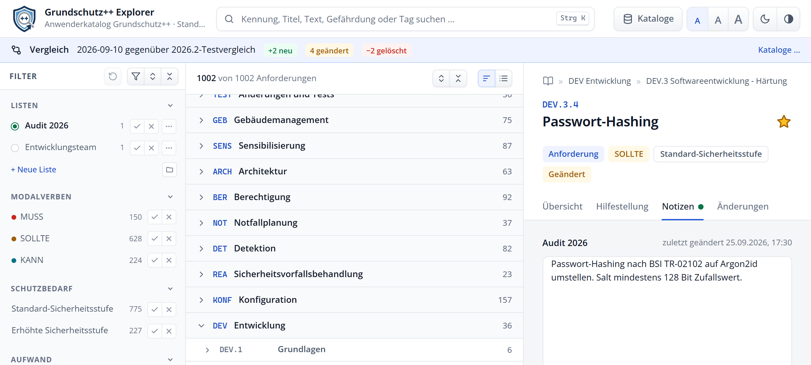

# Kataloge laden und vergleichen

Der Explorer kann beliebig viele Stände des Grundschutz++-Katalogs lokal im Browser speichern und jeweils zwei davon direkt miteinander vergleichen.

## Kataloge laden

Über **Kataloge → Katalog laden** in der Kopfzeile (oder über **Katalog laden** auf der Startseite) öffnen Sie [den schon in Abschnitt 1.2 vorgestellten Ladedialog](#fig-start-katalog-laden):

Der Dialog bietet drei flexible Wege:

| Weg | Funktionsweise |
| :--- | :--- |
| **Offiziellen BSI Grundschutz++ Anwenderkatalog laden** | Ruft direkt den neuesten offiziellen Katalog aus der Stand-der-Technik-Bibliothek des BSI auf GitHub ab. |
| **URL zur JSON-Datei** | Lädt einen OSCAL-Katalog von einer frei wählbaren Webadresse (https). |
| **JSON-Datei** | Lädt einen OSCAL-Katalog von Ihrem Rechner – wahlweise per Dateidialog oder bequem per Drag & Drop. |

- **Automatische Duplikaterkennung:** Ist ein inhaltlich identischer Katalog bereits gespeichert, erkennt der Explorer dies sofort und vermeidet doppelte Datenhaltung.
- **Sichere Formatprüfung:** Der Explorer verarbeitet standardkonforme Kataloge im Format NIST OSCAL 1.1.3 JSON. Weicht eine Datei vom Schema ab, wird sie mit einer präzisen Fehlermeldung abgewiesen.

> [!NOTE]
> Das Laden großer Katalogdateien geschieht dank des optimierten Zero-Build-Parsers in der Regel in weniger als einer Sekunde.

---

## Versionen verwalten

Der Dialog **Kataloge** in der Kopfzeile listet alle in Ihrem Browser hinterlegten Stände mit Titel, Version und Importdatum auf:

{width=70%}

/// figure-caption
    attrs: {id: fig-kataloge-versionen}
Dialog „Kataloge“: getrennte Auswahlknöpfe für „Anzeigen“ und „Vergleich“
///

In der Tabelle steuern Sie die Stände über zwei intuitive Auswahlschalter:

- **Anzeigen (Blauer Punkt):** Bestimmt, welcher Katalog die Basis der aktuellen Ansicht bildet.
- **Vergleich (Grauer Punkt):** Bestimmt den zweiten Katalogstand, gegen den verglichen wird. Ein erneuter Klick auf den Vergleichsstand beendet den Vergleich.
- **Rollentausch:** Wählen Sie den bisherigen Vergleichsstand als *Anzeigen*, tauschen beide Stände automatisch die Rollen.
- **Papierkorb:** Löscht einen Katalogstand nach einer Sicherheitsabfrage aus Ihrem Browser.

---

## Zwei Stände im Vergleichsmodus analysieren

Wählen Sie im Dialog **Kataloge** den neueren Stand zum **Anzeigen** und den älteren Stand als **Vergleich**.

{width=100%}

/// figure-caption
    attrs: {id: fig-vergleich}
Vergleichsmodus mit Hinweisbalken, Farbmarkierungen im Baum und geänderter Detailansicht
///

Im Vergleichsmodus schaltet der Explorer spezielle Analysehilfen frei:

1. **Hinweisbalken oben:** Nennt beide verglichenen Stände und summiert die Änderungen:
   - **+ [Zahl] neu** (grün): Anforderungen, die im neueren Stand hinzugekommen sind.
   - **[Zahl] geändert** (gelb): Anforderungen mit inhaltlichen oder strukturellen Änderungen.
   - **− [Zahl] gelöscht** (rot): Anforderungen, die im neueren Stand entfallen sind.
2. **Kennzeichnung im Baum:** Betroffene Anforderungen sind in der Liste mit farbigen Badges (*Neu*, *Geändert*, *Gelöscht*) gekennzeichnet.
3. **Filterbereich „Änderungen“:** In der Filterleiste erscheint der Abschnitt *Änderungen*. Damit isolieren Sie z. B. mit einem Klick nur die veränderten Anforderungen.
4. **Reiter „Änderungen“ in der Detailansicht:** Zeigt alle veränderten Eigenschaften in einer kompakten Tabelle und bietet für den Anforderungstext sowie die Hilfestellung einen exakten **Wortvergleich** (durchgestrichene alte Wörter vs. grün hervorgehobene neue Wörter).
5. **Vergleich beenden:** Ein Klick auf das Kreuz im Hinweisbalken (oder ein erneuter Klick auf den Vergleichsstand im Kataloge-Dialog) beendet den Vergleichsmodus.

---

## Gespeicherte Daten bereinigen

Möchten Sie alle im Browser gespeicherten Kataloge, Listen, Notizen und Einstellungen vollständig zurücksetzen, öffnen Sie in der Fußzeile die **Datenschutzerklärung** und klicken auf **Alle lokal gespeicherten Daten löschen**. Der Browser wird dabei vollständig in den Auslieferungszustand zurückversetzt.
