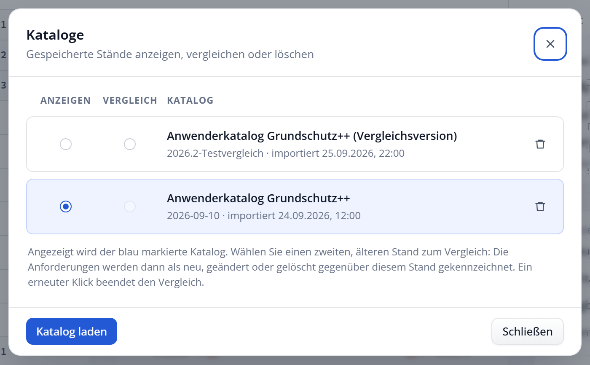
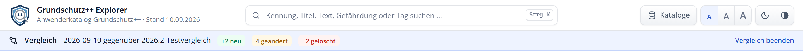
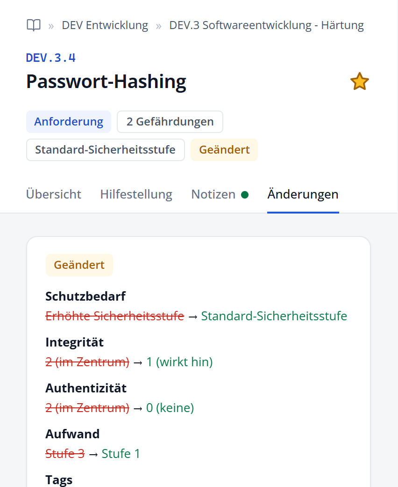

# Kataloge laden und vergleichen {#kap-kataloge}

Grundschutz++ Explorer speichert beliebig viele Stände des Grundschutz++-Katalogs in Ihrem Browser und vergleicht jeweils zwei davon miteinander.

## Kataloge laden

Über **Kataloge → Katalog laden** in der Kopfzeile oder **Katalog laden** auf der Startseite öffnen Sie den [Ladedialog](#fig-start-katalog-laden). Er bietet drei Wege:

| Weg | Funktionsweise |
| :--- | :--- |
| **Offiziellen BSI Grundschutz++ Anwenderkatalog laden** | Ruft den aktuellen Katalog direkt aus der Stand-der-Technik-Bibliothek des BSI auf GitHub ab. Die Quelladresse steht darunter. |
| **URL zur JSON-Datei** | Lädt einen Katalog im Schema des Grundschutz++ von einer Webadresse. Erlaubt sind nur Adressen mit `https`. |
| **JSON-Datei** | Lädt einen Katalog im Schema des Grundschutz++ von Ihrem Rechner, per Dateiauswahl oder durch Ablegen der Datei auf dem Feld. |

- **Doppelte Kataloge:** Ist ein inhaltlich identischer Katalog bereits gespeichert, meldet der Dialog das und lädt ihn nicht ein zweites Mal.
- **Formatprüfung:** Der Explorer verarbeitet nur Kataloge im Schema des Grundschutz++ (JSON nach NIST OSCAL, gegliedert in Praktiken und Themen). Andere OSCAL-Kataloge, etwa mit weiteren Gruppen unterhalb der Themen, weist er mit einer Fehlermeldung ab, statt sie unvollständig anzuzeigen.

## Katalogstände verwalten

Der Dialog **Kataloge** in der Kopfzeile listet alle gespeicherten Stände mit Titel, Version und Importzeitpunkt:

{width=65%}

/// figure-caption
    attrs: {id: fig-kataloge-versionen}
Dialog „Kataloge“
///

- **Anzeigen:** bestimmt, welcher Katalog angezeigt wird. Der gewählte Stand ist blau hinterlegt.
- **Vergleich:** bestimmt einen zweiten Stand, gegen den verglichen wird. Ein erneuter Klick auf den Vergleichsstand beendet den Vergleich. Der gewählte Vergleich bleibt beim nächsten Aufruf erhalten.
- **Rollentausch:** Wählen Sie den bisherigen Vergleichsstand zum Anzeigen, tauschen beide Stände die Rollen.
- **Papierkorb:** löscht einen Stand nach einer Rückfrage aus Ihrem Browser. Den offiziellen Katalog können Sie jederzeit neu laden.

## Zwei Stände vergleichen

Wählen Sie im Dialog **Kataloge** den neueren Stand zum **Anzeigen** und den älteren als **Vergleich**. Der Explorer vergleicht alle Angaben jeder Anforderung: Titel, Anforderungstext und Hilfestellung, Modalverb, Schutzbedarf, Zielobjektkategorien, Schutzziele, Handlungswort, Dokumentation, gefordertes Ergebnis und Spezifikation, Aufwand, Tags, Gefährdungen, verknüpfte Anforderungen, Quellkatalog, die Einordnung im Katalog und die UUID.

{width=100%}

/// figure-caption
    attrs: {id: fig-vergleich}
Vergleichsmodus
///

Im Vergleichsmodus stehen zusätzliche Hilfen bereit:

1. **Hinweisbalken:** nennt beide Stände und die Zahl der Änderungen: **neu** (grün) sind Anforderungen, die im angezeigten Stand hinzugekommen sind, **geändert** (gelb) solche mit geänderten Angaben, **gelöscht** (rot) solche, die im angezeigten Stand entfallen sind. Der Balken erscheint auch, wenn es keine Unterschiede gibt. Ändern oder beenden lässt sich der Vergleich über **Kataloge** in der Kopfzeile.
2. **Kennzeichnung in der Liste:** Betroffene Anforderungen tragen die Hinweise *Neu*, *Geändert* oder *Gelöscht*. Gelöschte Anforderungen bleiben sichtbar, damit Sie nachvollziehen können, was entfallen ist.
3. **Filterbereich „Änderungen“:** Mit ihm grenzen Sie die Liste z. B. auf die geänderten Anforderungen ein.
4. **Übersichten:** Katalog-, Praktik- und Themenübersicht nennen die Zahl der neuen, geänderten und gelöschten Anforderungen.
5. **Reiter „Änderungen“** in der Detailansicht (siehe unten).

### Reiter „Änderungen“

Unterscheiden sich die beiden Stände, zeigt die Detailansicht den Reiter **Änderungen** mit den Unterschieden der gewählten Anforderung (in der Abbildung mit eingeklapptem Kopfbereich). Ist sie neu, gelöscht oder unverändert, nennt ein Feld **Status** dies zuerst:

{width=48%}

/// figure-caption
    attrs: {id: fig-detail-aenderungen}
Reiter „Änderungen“
///

1. **Änderungsübersicht:** alle geänderten Angaben mit den Bezeichnungen der Detailansicht, bei einzelnen Werten als *alt → neu*, z. B. ein Modalverb von `MUSS` auf `SOLLTE`. Bei Listen wie Tags oder Gefährdungen stehen entfallene Werte rot, hinzugekommene grün.
2. **Textvergleich:** Für Anforderungstext und Hilfestellung zeigt ein Wortvergleich gestrichene Stellen rot durchgestrichen und neue Stellen grün hervorgehoben.

## Gespeicherte Daten löschen

Um alle gespeicherten Kataloge, Listen, Notizen und Einstellungen zu löschen, öffnen Sie in der Fußzeile **Datenschutz** und klicken auf **Alle lokal gespeicherten Daten löschen**. Nach einer Rückfrage entfernt der Explorer alle Daten, die er in Ihrem Browser abgelegt hat, und zeigt wieder die Startseite wie beim ersten Aufruf. Andere Daten Ihres Browsers bleiben unberührt.

> [!WARNING]
> Dieser Schritt lässt sich nicht rückgängig machen. Sichern Sie Ihre Listen vorher über **Alle Listen sichern** (siehe [Kapitel „Listen und Notizen“](#kap-listen-notizen)).
